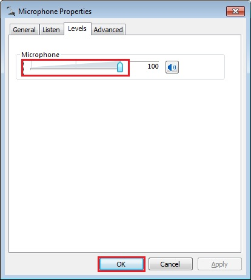
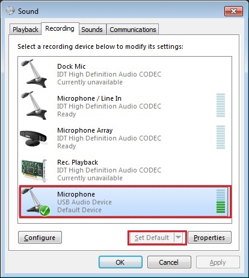

# dev_audio_generator_lite_bm

## Overview

The USB Audio Generator application is a simple demonstration program based on the MCUXpresso SDK.
It is enumerated as a recording device and users can record the sound from this device via the "Sound Recorder" in the Windows Accessories.

## System Requirement

### Hardware requirements

- Mini/micro USB cable
- USB A to micro AB cable
- Hardware (Tower System/base module) for a specific device
- Personal Computer(PC)

### Software requirements

- The project files for lite version examples are in the following path:
  <MCUXpresso_SDK_Install>/boards/<board>/usb_examples/usb_device_audio_generator_lite/<rtos>/<toolchain>.
   For non-lite version examples, the path is:
  <MCUXpresso_SDK_Install>/boards/<board>/usb_examples/usb_device_audio_generator/<rtos>/<toolchain>.
> The <rtos> is Bare Metal or FreeRTOS OS.

## Getting Started

### Hardware Settings

> Set the hardware jumpers (Tower system/base module) to default settings.

### Prepare the example

1.  Connect a USB cable between the PC host and the debugger USB port on the board to provide power supply (the example is self-powered).
2.  Download the program to the target board via IDE.
3.  Either press the reset button on your board or launch the debugger in your IDE to begin running the demo.
4.  Connect a USB cable between the PC host and the USB device port on the board.
5.  Demo start log is printed.
 

For detailed instructions, see the appropriate board User's Guide.

## Run the example in Windows

> The mentioned steps can be different for Recording settings as per different Windows OS version.

1.  A USB AUDIO DEMO device shows up as enumerated in the Device Manager.
 
2.  Right click on the sound control icon of the Start bar (close to the clock) and select the "Recording devices" option.
 
3.  In the pop-up window, select the "Microphone" device with the description "USB Audio Device" and click on the "Properties" button.
 
4.  On the new window, go to the "Levels" tab, and move the slide until 100%. Click "OK".
 
5.  Ensure that the selected "Microphone-USB AUDIO DEMO" is display as Default device if no other microphone device supported by the Windows system. If it's not mention as default device then click on the "Set default" option to make "Microphone-USB AUDIO DEMO" as a default device.
 
6.  Open the "Sound Recorder" application and record audio for about 5-10 seconds.
7.  After recording, open the recorder file with any media player and verify it by listening on the speaker of Laptop/PC.

note 
1.  On Aruba which has DMIC module, please speaker to the DMIC when recording, the recorder file is the sound which is recorded by DMIC.
2.  When connected to MacBook&reg;, change the PCM format from (0x02,0x00,) to (0x01,0x00, ) in  g_config_descriptor[CONFIG_DESC_SIZE] in the usb_descriptor.c. Otherwise, it can't be enumerated and noise is present when recording with the QuickTime&reg; player because the sampling frequency and bit resolution do not match.
3.  USB audio class 2.0 is enabled by default.
4.  When device functionality is changed, such as USB auido class 2.0 or UAC 5.1, please uninstall the previous PC driver to make sure the device with changed functionality can run normally.
5.  If you're having audio problems on Windows 10 for recorder, please disable signal enhancement as the following if it is enabled and have a try again.
 

## Supported Boards
- MIMXRT1170-EVKB
- FRDM-MCXC444
- FRDM-K22F
- LPCXpresso55S69
- EVK-MIMXRT1064
- FRDM-MCXA153
- MIMXRT685-AUD-EVK
- FRDM-MCXA276
- LPCXpresso54S018
- LPCXpresso55S16
- FRDM-K32L2B
- LPCXpresso54S018M
- MIMXRT1060-EVKB
- EVK-MIMXRT1010
- MIMXRT1040-EVK
- FRDM-MCXN947
- MIMXRT1024-EVK
- LPCXpresso55S28
- LPCXpresso54628
- LPCXpresso55S36
- MCX-N5XX-EVK
- MIMXRT1060-EVKC
- MIMXRT1160-EVK
- MIMXRT1180-EVK
- FRDM-K32L2A4S
- EVK-MIMXRT1020
- MIMXRT700-EVK
- FRDM-MCXA156
- EVK-MIMXRT595
- EVK-MIMXRT685
- FRDM-MCXC242
- MCX-N9XX-EVK
- EVKB-IMXRT1050
- RD-RW612-BGA
- FRDM-K32L3A6
- EVK-MIMXRT1015
- FRDM-MCXN236
- FRDM-RW612
