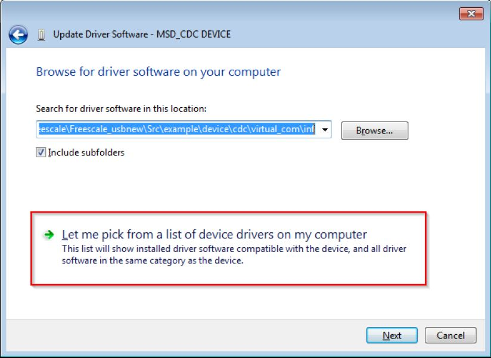
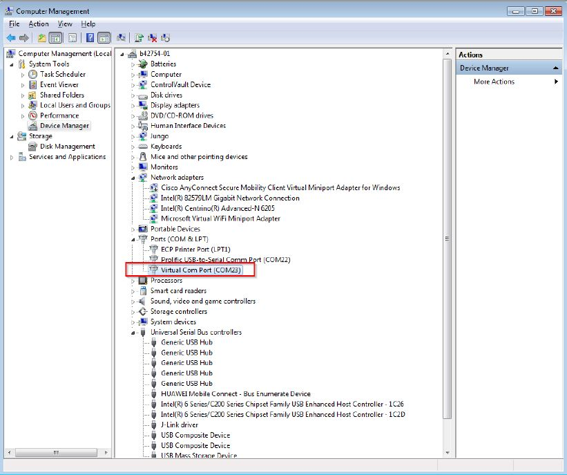

# dev_cdc_vcom

## Overview

The Virtual COM project is a simple demonstration program based on the MCUXpresso SDK.  
It is enumerated as a COM port, which the users can open using terminal tools, such as TeraTerm. 
The demo echoes back any character it receives. The purpose of this demo is to show how to build a device of USB CDC class and to 
provide a simple project for further development.

## System Requirement

### Hardware requirements

- Mini/micro USB cable
- USB A to micro AB cable
- Hardware (Tower module/base board, and so on) for a specific device
- Personal Computer

### Software requirements

- The project files are in:
  <MCUXpresso_SDK_Install>/boards/<board>/usb_examples/usb_device_cdc_vcom/<rtos>/<toolchain>.
  For lite version, the project files are in:
  <MCUXpresso_SDK_Install>/boards/<board>/usb_examples/usb_device_cdc_vcom_lite/<rtos>/<toolchain>.
> The <rtos> is Bare Metal or FreeRTOS OS.

## Getting Started

### Hardware Settings

> Set the hardware jumpers (Tower system/base module) to default settings.

### Prepare the example 

1.  Download the program to the target board.
2.  Connect the target board to the external power source (the example is self-powered).
3.  Either press the reset button on your board or launch the debugger in your IDE to begin running
    the demo.
4.  Connect a USB cable between the PC host and the USB device port on the board.

> For detailed instructions, see the appropriate board User's Guide.

## Run the example in Windows

1.  A COM port is enumerated in the Device Manager. If it prompts for CDC driver installation, see the next section to install the CDC driver.
2.  Open the COM port in a terminal tool, such as Tera Term.
3.  Type characters. The characters are echoed back from the COM port.
 
Note
  - Because there is no dynamic detection between the host and the device, the COM port must be closed from the terminal tool prior to 
  unplugging the CDC device. Otherwise, the CDC device won't get recognized next time when plugging in with the COM port still opened.
  - If no HW FLOW CONTROL is needed, let the variable s_cdcVcom.startTransactions always be TRUE.
  - If the terminal shows 'serial port number failure', check the 'DTR' item in terminal configuration window or set the variable 
  s_cdcVcom.startTransactions always be true in code.

## Run the example in Linux/Android
### Ubuntu X86 Linux PC
Steps:
1. Connect CDC device to the PC.
2. In the terminal window, run\n
`# ls /dev/tty*`\n
Then '/dev/ttyACM0' is found.
3. In the terminal window, run \n 
`# minicom -s`\n
4. To configure the ttyACM0 as the default console and other configurations, run \n
`# minicom`\n 
The ttyACM0 can be opened successfully and user can input characters by using the minicom.

### i.MX 6DQ board with Yocto rootfs
Steps:
1. Enable the ACM feature and rebuild the kernel.\n
    `| Symbol: USB_ACM [=y] |`\n
    `| Type : tristate |`\n
    `| Prompt: USB Modem (CDC ACM) support |`\n
    `| Location: |`\n
    `| -> Device Drivers |`\n
    `| -> USB support (USB_SUPPORT [=y]) |`\n
    `| (1) -> Support for Host-side USB (USB [=y])`
2. Bring up i.MX board with the rebuilt kernel.
3. Plug in the CDC device to the i.MX board.
4. In the i.MX board.\n
`# ls /dev/tty*`\n
The /dev/ttyACM0 is found.
5. In the i.MX board, a pipe is used to read and write to ttyACM0 because the minicom is not available for yactor rootfs.\n
`# cat /dev/ttyACM0 >> read1 &`\n
`# echo "Hello World" > /dev/ttyACM0`\n
`# fg`\n
Ctrl+c to interrupt the progress\n
`# vi read1`\n
Result: "Hello world" is in read1.

## Keep alive feature
For SOCs which support the keep alive feature, this example can also be used to demonstrate such feature.

The following steps show how to run it on Windows OS.
1. Check the FSL_FEATURE_USB_KHCI_KEEP_ALIVE_ENABLED macro in <soc>_feature.h to see if the SOC support the keep alive feature.
2. Define USB_DEVICE_CONFIG_KEEP_ALIVE_MODE to 1 in usb_device_config.h.
3. Build the example and run.
4. Open the Debug UART port and Virtual Com port.
5. Wait for a while to ensure that the device has entered into low power mode.
6. Type some characters in the Virtual Com port to exit from the low power mode.

Below is the run-time picture of the keep alive example.
 

## Installing the CDC driver for virtual_com and msd_cdc composite example
Below are the steps to install the CDC driver on Windows 7. Similar steps apply for Windows XP.

Step 1. Click "Update Driver Software..."

 

Step 2. Choose "Browse..."

 

Step 3. Select "Let me pick..."

 

Step 4. Navigate to your CDC driver location.

<install_dir>\\boards\\<board>\\usb_examples\\usb_device_cdc_vcom\\inf

or

<install_dir>\\boards\\<board>\\usb_examples\\usb_device_cdc_vcom_lite\\inf

 

Step 5. Press "Next".

 

Step 6. Ignore the warning and press "Yes".

 

Step 7. Now the CDC driver should be installed successfully.

 

- If a driver signature issue occurs on Windows 8 OS,  see the link,\n
[Disabling Driver Signature on Windows 8](https://learn.sparkfun.com/tutorials/disabling-driver-signature-on-windows-8/disabling-signed-driver-enforcement-on-windows-8)
- To enable driver signing on Windows OS, see the link,
  + <a href="msdn.microsoft.com/en-us/library/windows/hardware/ff544865(v=vs.85.aspx)">Driver Signing</a>
  + [Practical Windows Code and Driver Signing](http://www.davidegrayson.com/signing/#howto)

> USB_DEVICE_CONFIG_CDC_CIC_EP_DISABLE macro is used to disable the interrupt endpoint of communication interface class, this macro is 0 by default. If you want to disable the interrupt endpoint, please change the USB_DEVICE_CONFIG_CDC_CIC_EP_DISABLE macro as 1.

*/

## Supported Boards
- MIMXRT1170-EVKB
- FRDM-K22F
- LPCXpresso55S69
- EVK-MIMXRT1064
- FRDM-MCXA153
- MIMXRT685-AUD-EVK
- FRDM-MCXA276
- LPCXpresso51U68
- LPCXpresso54S018
- [LPCXpresso55S16](../../_boards/lpcxpresso55s16/usb_examples/usb_device_cdc_vcom/example_board_readme.md)
- LPCXpresso54S018M
- MIMXRT1060-EVKB
- EVK-MIMXRT1010
- MIMXRT1040-EVK
- FRDM-MCXN947
- MIMXRT1024-EVK
- LPCXpresso55S28
- LPCXpresso54628
- LPCXpresso55S36
- MCX-N5XX-EVK
- MIMXRT1060-EVKC
- MIMXRT1160-EVK
- MIMXRT1180-EVK
- [FRDM-K32L2A4S](../../_boards/frdmk32l2a4s/usb_examples/usb_device_cdc_vcom/example_board_readme.md)
- EVK-MIMXRT1020
- MIMXRT700-EVK
- FRDM-MCXA156
- EVK-MIMXRT595
- EVK-MIMXRT685
- MCX-N9XX-EVK
- EVKB-IMXRT1050
- RD-RW612-BGA
- FRDM-K32L3A6
- EVK-MIMXRT1015
- FRDM-MCXN236
- FRDM-RW612
