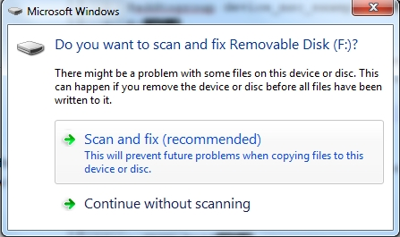
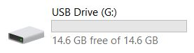
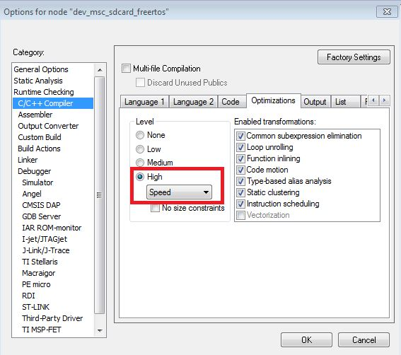
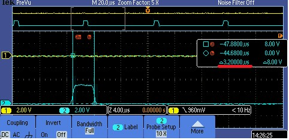
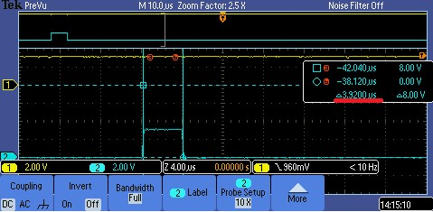
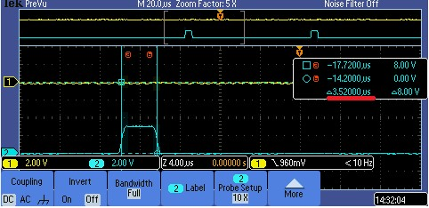

# dev_msc_disk_lite_bm

## Overview

The USB MSC DISK application is a simple demonstration program based on the MCUXpresso SDK.
It is enumerated as a U-disk. Users can read and write the EMMC as a standard U-disk.

## System Requirement

### Hardware requirements

- Mini/micro USB cable
- USB A to micro AB cable
- Hardware (Tower module/base board, and so on) for a specific device
- Personal Computer (PC)

### Software requirements

- The project files for lite version example are in: 
  <MCUXpresso_SDK_Install>/boards/<board>/usb_examples/usb_device_msc_disk_lite/<rtos>/<toolchain>.
   For non-lite version example, the path is: 
  <MCUXpresso_SDK_Install>/boards/<board>/usb_examples/usb_device_msc_disk/<rtos>/<toolchain>.
> The <rtos> is Bare Metal or FreeRTOS OS.

## Getting Started

### Hardware Settings

> Set the hardware jumpers (Tower system/base module) to default settings.

### Prepare the example

1.  Download the program to the target board.
2.  Connect the target board to the external power source (the example is self-powered).
3.  Power off the target board. And then power on again.
4.  Connect a USB cable between the PC and the USB device port of the board.

> For detailed instructions, see the appropriate board User's Guide.

## Run the example

1.  Plug in the MSD disk device, which is running the usb_device_msc_disk example, into the PC. A USB Mass Storage Device is enumerated in the Device Manager.
2.  If the RAM disk function is enabled, Windows OS prompts the option to scan the u-disk.
 
the computer will display the capacity of removable disk.
 

note 
- The USB_DEVICE_MSC_READ_BUFF_SIZE and USB_DEVICE_MSC_WRITE_BUFF_SIZE macros limit the device identification and data transfer speed. 
   The larger the buffer size, the faster the data transfer speed.
   The buffer size should be a multiple of 512 with the smallest value being 512. 
   The USB DISK example has the following work mode. Note that different modes have different throughputs:
        1. The USB_DEVICE_CONFIG_USE_TASK is not enabled and the value is zero. 
  The USB DISK card example USB_DeviceMscCallback function  works in the USB IRQ handle function.
        2. The USB_DEVICE_CONFIG_USE_TASK is enabled. The USB DISK card example code works in task mode.
  USB_DeviceMscCallback is called in the task. In this use case,
          the throughput is lower than the throughput in use case 1.
        3. The USB_DEVICE_CONFIG_USE_TASK and USB_DEVICE_MSC_USE_WRITE_TASK are enabled. The write is used to optimize the throughput and the throughput is almost 
        the same as in use case 1.
        4. The USB_DEVICE_CONFIG_USE_TASK is not enabled and the USB_DEVICE_MSC_USE_WRITE_TASK is enabled. This use case is not allowed.
- The throughput of the FreeRTOS example may be lower than the bm example when use KHCI (full speed controller) on some types of PCs.
    The root cause of the issue is that OUT tokens are sent too quickly on some types of PCs so that the receiving buffer on the device side could not be
    prepared in time. The detail analysis is in the later chapter.
 The throughput of the FreeRTOS example may be improved through adjusting the code optimizations of IAR. The setting method is as below figure:
    In IAR, setting Option->C/C++ Compiler->Optimizations. 
 
    The reason that the device does not prepare the receiving buffer in time is explained as the following (the following measurement is done on the TWR-K65 module):
  GPIO Pulling up means: the previous token done interrupt received
  GPIO Pulling down means: the next data receiving buffer is primed.
  1. In the bare metal example, the time between GPIO pulling up and down is about 3.2 us. 
 
  2. In the FreeRTOS example, it is about 4 us.
 
        It takes longer to prime the buffer in the FreeRTOS example, when the Host sends OUT the token too fast, the receiving data buffer might not be ready yet,
    and some NAKs will occur during the data transfer. Once a NAK occurs, because there is no ping control in the USB 1.1, the host has to send out the data (64 bytes) 
    packet before the NAK packet can be received. On the full speed bus, this 64 bytes data packet consumes ~45 us. The 45 us delay is the root cause why the throughput on 
    the FreeRTOS drops.
  For some hosts, the interval between the previous transaction and next is a little longer, for example 7 us and there is enough time for the device to prepare the next receiving
    buffer. In this case, NAK does not occur at all and the throughput is higher.
  3. After adjusting the optimization, the time is about 3.6 us.
 
    Therefore, the NAK number can be reducecd during the transfer and the throughput can be increased.
*/

## Supported Boards
- MIMXRT1170-EVKB
- LPCXpresso55S69
- EVK-MIMXRT1064
- MIMXRT685-AUD-EVK
- LPCXpresso54S018
- LPCXpresso54S018M
- MIMXRT1060-EVKB
- MIMXRT1040-EVK
- FRDM-MCXN947
- MIMXRT1024-EVK
- LPCXpresso55S28
- LPCXpresso54628
- MCX-N5XX-EVK
- MIMXRT1060-EVKC
- MIMXRT1160-EVK
- MIMXRT1180-EVK
- EVK-MIMXRT1020
- MIMXRT700-EVK
- EVK-MIMXRT595
- EVK-MIMXRT685
- MCX-N9XX-EVK
- EVKB-IMXRT1050
