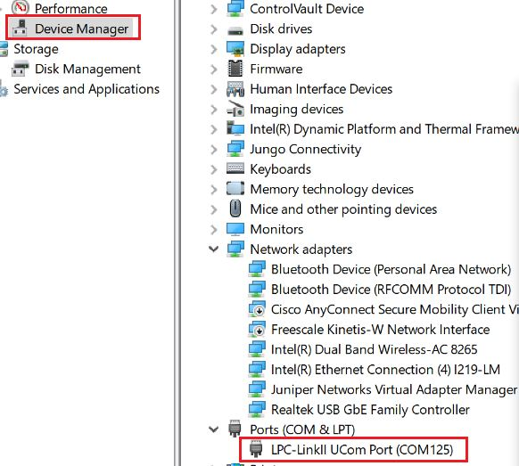
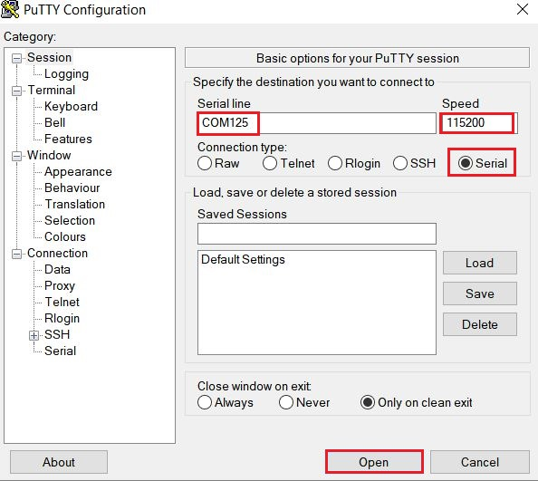
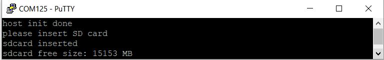
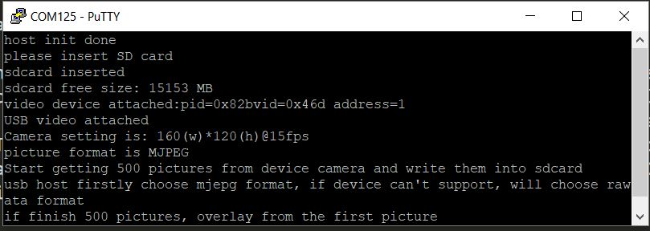
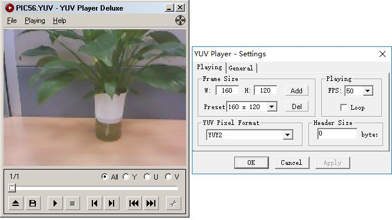
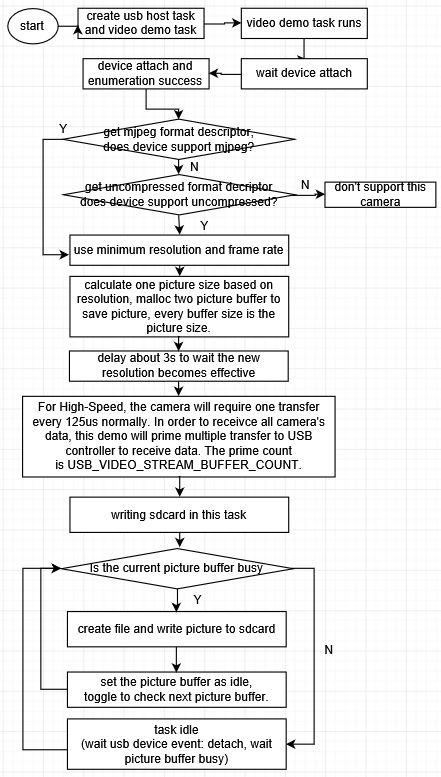
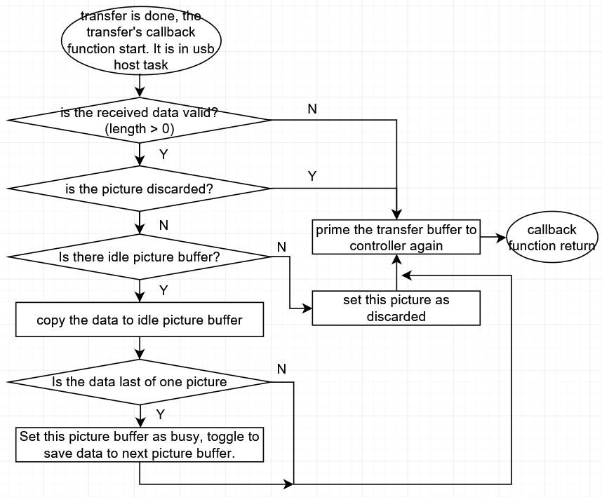

# host_video_camera_freertos

## Overview

This USB example demonstrates usb host video functionality. It can support different types of camera devices
and formats.   
  The application prints the attached device information when the camera device is attached, then it stores the pictures from camera device into SD card which has FAT32 file system on it. Finally, You can view the pictures in PC with some tools directly.

## System Requirement

### Hardware requirements

- Mini/micro USB cable
- USB A to micro AB cable
- Hardware (Tower module/base board, and so on) for a specific device
- Personal Computer (PC)

### Software requirements

- The project path is: 
  <MCUXpresso_SDK_Install>/boards/<board>/usb_examples/usb_host_video_camera/<rtos>/<toolchain>.
> The <rtos> is FreeRTOS OS, not support Bare Metal. In the bare metal, writing sdcard is in blocking mode and USB transfer is faster than writing sd card, so the host can't guarantee getting all of data of device camera (some transfers may be lost). 

## Getting Started

### Hardware Settings

> Set the hardware jumpers (Tower system/base module) to default settings.

### Prepare the example 

1.  Download the program to the target board.
2.  Power off the target board and power on again.
3.  Prepare a sdcard and format it with FAT32 file system.

> For detailed instructions, see the appropriate board User's Guide.

## Run the example

1.  Connect the board UART to the PC, you can see the Serial port number from "Device Manager", then open the COM port in a terminal tool such as PuTTy as the following picture, the baud rate is 115200.
 
 

2.  Insert the SD card into the slot. "sdcard inserted" and free memory size is printed out in the terminal
as the following image. 
 

3.  Make sure to use a USB HUB or an adapter with OTG functionality firstly. The USB video camera information is printed in the terminal when USB video camera device is attached, including resolution, frame rate and the using picture format. the USB application automatically try to get
    mjpeg format from camera device firstly, if camera device doesn't support mjpeg format, the USB application will use raw data. Then, host application will get stream data from the USB video camera device and saves them into SD card. If mjpeg format is selected, then the format of the saved picture is MJPEG; 
    if raw data is selected, in our application we just saved pictures as YUV format whatever the actual raw data format is. So please use a YUV format camera to test raw data picture. This example will save 500 pictures from camera device into SD card. If 500 pictures are finished, this example will continue
    getting pictures and overlay from the first picture in SD card, so the pictures are always newest.
    The following figure is an example for attaching one camera device.
 

4.  If you want to end up demo, please detach the camera device firstly then remove the sdcard. Then you can
    use some tools in PC to open the pictures in sdcard directly. For MJPEG picture, you can open it using default image viewing tool in windows OS. For YUV picture, you can use YUV Player Deluxe to open it as following. The YUV Player Deluxe can be downloaded from http://www.yuvplayer.com
 

> 1. After sdcard is inserted, host video application will do an open and close operation to make sure the sdcard is fully ready.   
> 2. This application chooses the minimum resolution and minimum frame rate that is supported by camera device. Then based on the resolution, host video application will malloc enough buffer to save one picture and use pingpong buffers. All of data for one picture is copied into one buffer, when the last frame is copied, host application will use another buffer to do data copy and trigger another low priority task to write the picture data of current buffer into sdcard.
> 3. After camera device is attached, host video application will do a little delay (about 3s) to wait camera device to set proper resolution and be ready. 
> 4. This application primes multiple ISO IN transfers, the prime count is USB_VIDEO_PICTURE_COUNT and default value is 6. The bigger this value is, the more sources(such as memory) USB controller uses and the performance would be higher, but the influence to the peformance will become very small after USB_VIDEO_PICTURE_COUNT value reaches 6, so we recommand to set it as 6. 
> 5. There is a known issue that the time cost to write data into sdcard would be random in the range of 10ms to 70ms, so it might exceed the max interval between two video frames. For example, if the frame rate is 15fps, the max interval between two video frames is 67ms; if the frame rate is 30fps, the max interval between two video frames is 33ms. Due to this issue, there will be some video frames lost during the sdcard writing operation. After camera device is detached, the dicarded picture frame count will be printed in the terminal. 
> 6. It had better to use sandisk 3.0 becasue sandisk 3.0 sdcard is faster. 

  the following is the camera devices which have been tested.
      (1) Logitech M/N:V-U0026
      (2) GUCEE G20
      (3) LPC54018/FRDMK28F FS/FRDMK28F HS which are running the virtual camera example in our SDK

  The following image is the working flow of the host video application.
 

  The following image is the working flow of the host video transfer callback.
 

## Supported Boards
- MIMXRT1170-EVKB
- LPCXpresso55S69
- EVK-MIMXRT1064
- MIMXRT685-AUD-EVK
- LPCXpresso54S018
- LPCXpresso54S018M
- MIMXRT1060-EVKB
- [MIMXRT1040-EVK](../../_boards/evkmimxrt1040/usb_examples/usb_host_video_camera/example_board_readme.md)
- [FRDM-MCXN947](../../_boards/frdmmcxn947/usb_examples/usb_host_video_camera/example_board_readme.md)
- MIMXRT1024-EVK
- LPCXpresso55S28
- [MCX-N5XX-EVK](../../_boards/mcxn5xxevk/usb_examples/usb_host_video_camera/example_board_readme.md)
- MIMXRT1060-EVKC
- MIMXRT1160-EVK
- MIMXRT1180-EVK
- EVK-MIMXRT1020
- MIMXRT700-EVK
- [EVK-MIMXRT595](../../_boards/evkmimxrt595/usb_examples/usb_host_video_camera/example_board_readme.md)
- EVK-MIMXRT685
- [MCX-N9XX-EVK](../../_boards/mcxn9xxevk/usb_examples/usb_host_video_camera/example_board_readme.md)
- EVKB-IMXRT1050
