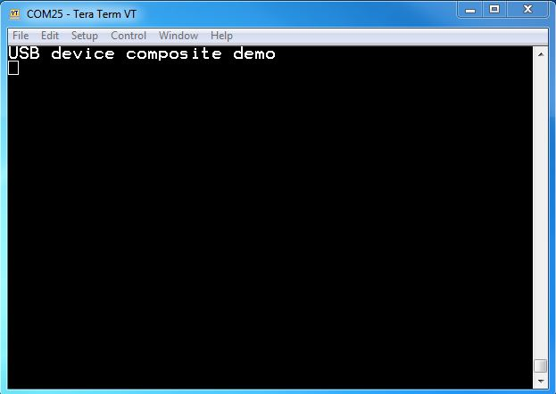
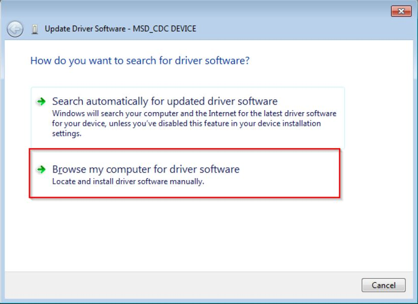

# dev_composite_cdc_vcom_cdc_vcom_lite_bm

## Overview

The Composite CDC_VCOM_CDC_VCOM project is a simple demonstration program based on the MCUXpresso SDK.  
It is enumerated as two COM port, which can be opened using terminal tools, such as TeraTerm. 
The demo echoes back any character it receives.
The purpose of this demo is to show how to build a composite USB device and to provide a simple example for further development.

## System Requirement

### Hardware requirements

- Mini/micro USB cable
- USB A to micro AB cable
- Hardware (Tower module/base board, and so on) for a specific device
- Personal Computer

### Software requirements

- The project files are in: 
  <MCUXpresso_SDK_Install>/boards/<board>/usb_examples/usb_device_composite_cdc_vcom_cdc_vcom/<rtos>/<toolchain>.
  For a lite version, the project files are in: 
  <MCUXpresso_SDK_Install>/boards/<board>/usb_examples/usb_device_composite_cdc_vcom_cdc_vcom_lite/<rtos>/<toolchain>.
> The <rtos> is Bare Metal or FreeRTOS OS.

## Getting Started

### Hardware Settings

> Set the hardware jumpers (Tower system/base module) to default settings.

### Prepare the example 

1.  Download the program to the target board.
2.  Connect the target board to the external power source (the example is self-powered).
3.  Either press the reset button on your board or launch the debugger in your IDE to begin running
    the demo.
4.  Connect a USB cable between the PC host and the USB device port on the board.

> For detailed instructions, see the appropriate board User's Guide.

## Run the example in Windows OS

1.  Two COM port are enumerated in the Device Manager. 
If it prompts for CDC driver installation, see the next section to install the CDC driver.
2.  Open the COM port in a terminal tool, such as the Tera Term.
3.  Type some characters, which are echoed back from the COM port.
 

note 
-  Because there is no dynamic detection between the host and the device, the COM port must be closed from the terminal tool prior to unplugging the CDC device. 
Otherwise, the CDC device won't get recognized next time that it is plugged in with the COM port still opened.
-  If no hardware FLOW CONTROL is needed, set the variable start_transactions to TRUE.
-  Enable composite cdc vcom + cdc cvom need additional about 350byte falsh and about 900byte ram compared with "usb_device_cdc_vcom" for full speed devcie, for high speed device, the ram size will be larger, because the default max packet size 512 which means the default buffer size used in application is 512byte.

## Installing the CDC driver for virtual_com composite example
Below are the steps to install the CDC driver on Windows 7 OS. Similar process applies to Windows XP OS.
note 
- PC will enumerate two "usb composite device", the following steps should done for each device. 

  
Step 1. Click "Update Driver Software..."

 

Step 2. Choose "Browse..."

 

Step 3. Select "Let me pick..."

 

Step 4. Navigate to your CDC driver location.

<install_dir>\\boards\\<board>\\usb_examples\\usb_device_composite_cdc_vcom_cdc_vcom\\inf

or

<install_dir>\\boards\\<board>\\usb_examples\\usb_device_composite_cdc_vcom_cdc_vcom_lite\\inf

 

Step 5. Press "Next".

 

Step 6. Ignore the warning and press "Yes".

 

Step 7. Now the CDC driver should be installed successfully.

 

- If the driver signature issue occurs on Windows 8 OS, see the link,\n
[Disabling Driver Signature on Windows 8](https://learn.sparkfun.com/tutorials/disabling-driver-signature-on-windows-8/disabling-signed-driver-enforcement-on-windows-8)
- To enable driver signing on Windows OS, see the link,
  + <a href="msdn.microsoft.com/en-us/library/windows/hardware/ff544865(v=vs.85.aspx)">Driver Signing</a>
  + [Practical Windows Code and Driver Signing](http://www.davidegrayson.com/signing/#howto)

*/

## Supported Boards
- MIMXRT1170-EVKB
- FRDM-MCXC444
- FRDM-K22F
- LPCXpresso55S69
- EVK-MIMXRT1064
- FRDM-MCXA153
- MIMXRT685-AUD-EVK
- FRDM-MCXA276
- LPCXpresso51U68
- LPCXpresso54S018
- LPCXpresso55S16
- FRDM-K32L2B
- LPCXpresso54S018M
- MIMXRT1060-EVKB
- EVK-MIMXRT1010
- MIMXRT1040-EVK
- FRDM-MCXN947
- MIMXRT1024-EVK
- LPCXpresso55S28
- LPCXpresso54628
- LPCXpresso55S36
- MCX-N5XX-EVK
- MIMXRT1060-EVKC
- MIMXRT1160-EVK
- MIMXRT1180-EVK
- FRDM-K32L2A4S
- EVK-MIMXRT1020
- MIMXRT700-EVK
- FRDM-MCXA156
- EVK-MIMXRT595
- EVK-MIMXRT685
- FRDM-MCXC242
- MCX-N9XX-EVK
- EVKB-IMXRT1050
- RD-RW612-BGA
- EVK-MIMXRT1015
- FRDM-MCXN236
- FRDM-RW612
