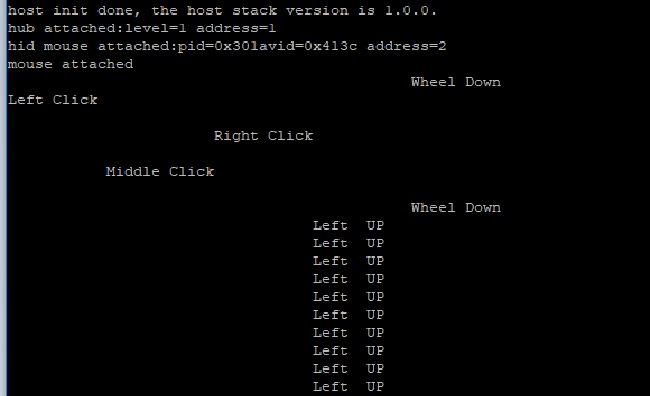

# host_hid_mouse


## Overview

This Host HID example is a simple demonstration program based on the MCUXpresso SDK. 
<br> The application supports the mouse device. It prints the mouse operation when the mouse device is attached.

## System Requirement

### Hardware requirements

- Mini/micro USB cable
- USB A to micro AB cable
- Hardware (Tower module/base board, and so on) for a specific device
- Personal Computer (PC)


### Software requirements

- The project path is: 
<br> <MCUXpresso_SDK_Install>/boards/<board>/usb_examples/usb_host_hid_mouse/<rtos>/<toolchain>.
> The <rtos> is Bare Metal or FreeRTOS OS.


## Getting Started

### Hardware Settings

> Set the hardware jumpers (Tower system/base module) to default settings.


### Prepare the example 

1.  Download the program to the target board.
2.  Power off the target board and power on again.
3.  Connect devices to the board.

> For detailed instructions, see the appropriate board User's Guide.
> Host hid example doesn't support HID report descriptor analysis, this example assume that the device data are sent by specific order. 
      <br> For more detail, please refer to the code. For the device list we tested,
      <br> please refer to chapter "Peripheral devices tested with the USB Host stack" in "SDK Release Notes xxxx(board name)".

## Run the example

1.  Connect the board UART to the PC and open the COM port in a terminal tool.
2.  Make sure to use a USB HUB or an adapter with OTG functionality firstly, then plug in the mouse device to the board. The attached information prints out in the terminal.  
3.  The mouse operation information prints in the terminal when you operate the mouse. 
    <br> The application prints the mouse operation information in one line. Each line contains the following sequential string: 
    "Left Click", "Middle Click", "Right Click", "Right"/"Left" movement, "UP"/"Down" movement and "Wheel Down"/"Wheel Up" movement.
    White space replaces the above string if the mouse doesn't have the corresponding operation.
    <br> For example, when the mouse moves right and up, 
    <br> ``` "                                  Right UP             "```
    <br> prints in the terminal.

The following figure is an example to attach one mouse device.

<br>


## Supported Boards
- MIMXRT1170-EVKB
- [FRDM-K22F](../../_boards/frdmk22f/usb_examples/usb_host_hid_mouse/example_board_readme.md)
- [LPCXpresso55S69](../../_boards/lpcxpresso55s69/usb_examples/usb_host_hid_mouse/example_board_readme.md)
- EVK-MIMXRT1064
- [MIMXRT685-AUD-EVK](../../_boards/mimxrt685audevk/usb_examples/usb_host_hid_mouse/example_board_readme.md)
- [LPCXpresso54S018](../../_boards/lpcxpresso54s018/usb_examples/usb_host_hid_mouse/example_board_readme.md)
- [LPCXpresso55S16](../../_boards/lpcxpresso55s16/usb_examples/usb_host_hid_mouse/example_board_readme.md)
- [LPCXpresso54S018M](../../_boards/lpcxpresso54s018m/usb_examples/usb_host_hid_mouse/example_board_readme.md)
- MIMXRT1060-EVKB
- EVK-MIMXRT1010
- MIMXRT1040-EVK
- FRDM-MCXN947
- MIMXRT1024-EVK
- [LPCXpresso55S28](../../_boards/lpcxpresso55s28/usb_examples/usb_host_hid_mouse/example_board_readme.md)
- [LPCXpresso54628](../../_boards/lpcxpresso54628/usb_examples/usb_host_hid_mouse/example_board_readme.md)
- LPCXpresso55S36
- [MCX-N5XX-EVK](../../_boards/mcxn5xxevk/usb_examples/usb_host_hid_mouse/example_board_readme.md)
- MIMXRT1060-EVKC
- MIMXRT1160-EVK
- MIMXRT1180-EVK
- [FRDM-K32L2A4S](../../_boards/frdmk32l2a4s/usb_examples/usb_host_hid_mouse/example_board_readme.md)
- EVK-MIMXRT1020
- MIMXRT700-EVK
- [EVK-MIMXRT595](../../_boards/evkmimxrt595/usb_examples/usb_host_hid_mouse/example_board_readme.md)
- [EVK-MIMXRT685](../../_boards/evkmimxrt685/usb_examples/usb_host_hid_mouse/example_board_readme.md)
- IMX95LPD5EVK-19
- [MCX-N9XX-EVK](../../_boards/mcxn9xxevk/usb_examples/usb_host_hid_mouse/example_board_readme.md)
- EVKB-IMXRT1050
- RD-RW612-BGA
- EVK-MIMXRT1015
- FRDM-MCXN236
- FRDM-RW612
