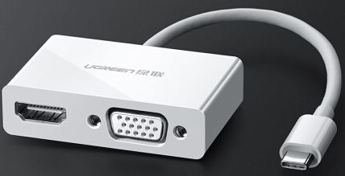

# usb_pd_alt_mode_dp_host

## Overview

This PD example is a simple demonstration based on the MCUXpresso SDK PD stack.
  The application use the shield host board (om13790host) to implement the DisplayPort alternate mode.
It recognize attached video adapters (like "Type-C to DisplayPort" or "Type-C to HDMI"), and drive the adapter to work.

## System Requirement

### Hardware requirements

- One Type-C shield host board
- One 9V DC power supply
- Type-C Cable
- One hardware for a specific device, for example: one lpcxpresso54114 board
- Personal Computer

### Software requirements

- The project files are in: 
  <MCUXpresso_SDK_Install>/boards/<board>/usb_examples/usb_pd_alt_mode_dp_host/<rtos>/<toolchain>.
> The <rtos> is Bare Metal or FreeRTOS OS.
- Terminal tool.

## Getting Started

### Hardware Settings

  For detailed instructions, see the appropriate board User's Guide.
> Please reference to the re-worked document for hardware settings.

### Prepare the example

1.  For MCUXpresso, please reference to the MCUXpresso SDK USB Type-C PD Stack User's Guide to make sure the SDK_DEBUGCONSOLE = 1 in project settings.
2.  Download the program to the target board.
3.  Power on shield host board then power on development board.

## Run the example

1.  Download this program to the board.
2.  Connect the video source (like: PC) to the MinDP port (J2).
3.  Connect one video adapter (like: "Type-C to DisplayPort" or "Type-C to HDMI") to the Type-C port (J1).
4.  Connect one displayer to the adapter.
    For example: if the adapter is one "Type-C to DisplayPort" adapter, connect displayer to the adapter with one DisplayPort cable.
5.  The video source (PC) will recognize the displayer and the displayer works.
6.  The follow UGREEN USB-C to HDMI/VGA device has one issue. If keeping the device connected with shield host board, then reset mcu board, the UGREEN device doesn't work.
 

## Supported Boards
- MIMXRT1170-EVKB
- FRDM-K22F
- LPCXpresso55S69
- EVK-MIMXRT1064
- MIMXRT685-AUD-EVK
- LPCXpresso55S16
- MIMXRT1060-EVKB
- MIMXRT1040-EVK
- FRDM-MCXN947
- LPCXpresso55S28
- LPCXpresso55S36
- MCX-N5XX-EVK
- MIMXRT1060-EVKC
- MIMXRT1160-EVK
- MIMXRT1180-EVK
- FRDM-K32L2A4S
- MIMXRT700-EVK
- EVK-MIMXRT595
- EVK-MIMXRT685
- MCX-N9XX-EVK
- EVKB-IMXRT1050
- EVK-MIMXRT1015
- FRDM-MCXN236
