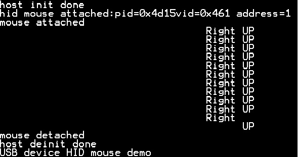

# pin_detect_hid_mouse

## Overview

This pin detect HID example supports the mouse device. 
  The application prints the operation information when the mouse device is attached or plugged in to the PC host.

## System Requirement

### Hardware requirements

- Mini/micro USB cable
- USB A to micro AB cable
- Hardware (Tower module/base board, and so on) for a specific device
- Personal Computer

### Software requirements

- The project files are in: 
  <MCUXpresso_SDK_Install>/boards/<board>/usb_examples/usb_pin_detect_hid_mouse/<rtos>/<toolchain>.
> The <rtos> is Bare Metal or FreeRTOS OS.

## Getting Started

### Hardware Settings

For detailed instructions, see the appropriate board User's Guide.
> The jumpers of the hardware (Tower system/base module) needs to be set to default setting at first.

### Prepare the example 

1.  Download the program to the target board.
2.  Power off the target board and power on again, or press the reset button on your board.

> For detailed instructions, see the appropriate board User's Guide.
> Host hid example doesn't support HID report descriptor analysis, this example assume that the device data are sent by specific order. 
        For more detail, please refer to the code. For the device list we tested,
        please refer to chapter "Peripheral devices tested with the USB Host stack" in "SDK Release Notes xxxx(board name)".

## Run the example

1. Connect the board UART to the PC and open the COM port in a terminal tool.
2. Run the pin_detect_hid_mouse example. The board now acts as an USB device mouse and a USB switch-to-device mode information is displayed.
3. Plug in a mouse to the test board. The board acts as an USB host. The stack switches to host mode and some device attached information is printed out.
4. When the mouse is moved, the relevant information is output to the screen, such as:
	When the mouse moved up, "UP" is displayed on the screen.
	When the mouse moved down, "DOWN" is displayed on the screen.
5. Unplug the mouse with the cable. The board now acts as a USB device mouse. The mouse is detached and the USB switches to the device mode information.
6. Plug in the mouse device into the PC. An HID-compliant mouse is enumerated in the Device Manager.
7. The mouse arrow is moving on the PC screen in a rectangular rotation.

The following figures show a pin detect HID mouse information for the pin detect HID mouse demo.
 

## Supported Boards
- MIMXRT1170-EVKB
- EVK-MIMXRT1010
- [MCX-N5XX-EVK](../../_boards/mcxn5xxevk/usb_examples/usb_pin_detect_hid_mouse/example_board_readme.md)
- [MCX-N9XX-EVK](../../_boards/mcxn9xxevk/usb_examples/usb_pin_detect_hid_mouse/example_board_readme.md)
- EVK-MIMXRT1064
- MIMXRT1060-EVKC
- MIMXRT1040-EVK
- EVKB-IMXRT1050
- MIMXRT1024-EVK
- [FRDM-MCXN947](../../_boards/frdmmcxn947/usb_examples/usb_pin_detect_hid_mouse/example_board_readme.md)
- FRDM-RW612
- MIMXRT1160-EVK
- MIMXRT1180-EVK
- RD-RW612-BGA
- EVK-MIMXRT1020
- EVK-MIMXRT1015
- [FRDM-MCXN236](../../_boards/frdmmcxn236/usb_examples/usb_pin_detect_hid_mouse/example_board_readme.md)
- MIMXRT1060-EVKB
