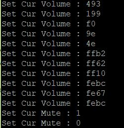

# dev_audio_speaker

## Overview

The USB Audio Speaker application is a simple demonstration program based on the MCUXpresso SDK. 
It is enumerated as a playback device and users can play music using the device.

## System Requirement

### Hardware requirements

- Mini/micro USB cable
- USB A to micro AB cable
- Specific hardware which has codec presented
- Personal Computer(PC)

### Software requirements

- The path for the project files for lite version example is: 
  <MCUXpresso_SDK_Install>/boards/<board>/usb_examples/usb_device_audio_speaker_lite/<rtos>/<toolchain>.
   For non-lite version example, the path is: 
  <MCUXpresso_SDK_Install>/boards/<board>/usb_examples/usb_device_audio_speaker/<rtos>/<toolchain>.
> The <rtos> is Bare Metal or FreeRTOS OS.

## Getting Started

### Hardware Settings

> Set the hardware jumpers (Tower system/base module) to default settings.

### Prepare the example

1.  Connect a USB cable between the PC host and the debugger USB port on the board to provide power supply (the example is self-powered).
2.  Download the program to the target board via IDE.
3.  Either press the reset button on your board or launch the debugger in your IDE to begin running the demo.
4.  Connect a USB cable between the PC host and the USB device port on the board.
5.  Demo start log is printed, note that the log can be different for multiple boards.
 

For detailed instructions, see the appropriate board User's Guide.

## Run the example in Windows (USB AUDIO CLASS 2.0)

> The mentioned steps can be different for Playback settings as per different Windows OS version.

1.  A USB AUDIO DEMO device shows up as enumerated in the Device Manager.
 
2.  Right click on the sound control icon of the Start bar (close to the clock) and select "Playback devices".
 
3.  In the pop-up window, select the "Playback" device with the description "USB Audio Device" and click on the "Properties" button.
 
4.  In the new window, go to "Levels" tab and move the slide until 100%. Click "OK".
 
 
5.  Ensure that the selected "Speakers-USB AUDIO DEMO" is display as Default device if no other speaker device supported by the Windows system. 
    If it's not mention as default device then click on the "Set default" option to make "Speakers-USB AUDIO DEMO" as a default device. 
 
6.  Connect the earphone/headphone at Audio Line Out port of target board. Open the Window Media Player application, select, and play your favorite song. Check that recorded audio is audible in the connected earphone/headphone at Audio Line Out port of target board.

## Run the example on a Mac&reg; (USB AUDIO CLASS 2.0)
1.  Plug-in the audio speaker device which is running the Audio Speaker example into the Mac.
2.  A USB audio device shows up as enumerated in the sound catalogue under the System Preferences.
3.  Select the USB audio speaker device as the default audio device in the sound catalogue under System Preferences.
4.  Open the QuickTime application. Select and play your favorite song.

note 
1. If the device audio speaker example uses an ISO IN feedback endpoint, please attach the device to a host like
PC which supports feedback function. Otherwise, there might be attachment issue or other problems.
2. USB audio class 2.0 is enabled by default. 
3. Based on the USB spec, the feedback endpoint data length should be 3 bytes if the device is full speed. In this case, device can work on Mac OS. However, device can not work on Win 10 and feedback data length must be set 4. There is a workaround to fix this issue, please open the macro
USB_DEVICE_WORKAROUND_AUDIO_20_WINDOWS when meets the following conditions:
  - USB device is full speed and USB audio class 2.0 is enabled.
  - USB device uses feedback endpoint.
  - USB host is Windows 10.
4. This example supports UAC 5.1 and UAC 5.1 is disabled by default, this feature can be enabled by set macro USB_AUDIO_CHANNEL5_1 as 1U. 
5. When device functionality is changed, such as USB auido class 2.0 or UAC 5.1, please uninstall the previous PC driver to make sure the device with changed functionality can run normally.
6. For the dev_audio_speaker_lite_bm.bin, if it uses feedback endpoint, it can not work on Windows 10 if the speed mode is full speed, please run it on Linux or Mac OS.
7. For IP3511HS in high speed mode, microframe can not be obtained and only for frame, the used feedback solution requires us to have to use larger latency and buffer size to avoid buffer overflow or underflow. Sync mode can use
   low latency (<1ms) even if on IP3511HS.

## Supported Boards
- MIMXRT1170-EVKB
- LPCXpresso55S69
- EVK-MIMXRT1064
- MIMXRT685-AUD-EVK
- [LPCXpresso55S16](../../_boards/lpcxpresso55s16/usb_examples/usb_device_audio_speaker/example_board_readme.md)
- MIMXRT1060-EVKB
- EVK-MIMXRT1010
- MIMXRT1040-EVK
- MIMXRT1024-EVK
- LPCXpresso55S28
- [LPCXpresso55S36](../../_boards/lpcxpresso55s36/usb_examples/usb_device_audio_speaker/example_board_readme.md)
- MCX-N5XX-EVK
- MIMXRT1060-EVKC
- MIMXRT1160-EVK
- MIMXRT1180-EVK
- EVK-MIMXRT1020
- MIMXRT700-EVK
- [EVK-MIMXRT595](../../_boards/evkmimxrt595/usb_examples/usb_device_audio_speaker/example_board_readme.md)
- [EVK-MIMXRT685](../../_boards/evkmimxrt685/usb_examples/usb_device_audio_speaker/example_board_readme.md)
- EVKB-IMXRT1050
- [RD-RW612-BGA](../../_boards/rdrw612bga/usb_examples/usb_device_audio_speaker/example_board_readme.md)
- EVK-MIMXRT1015
- FRDM-MCXN236
