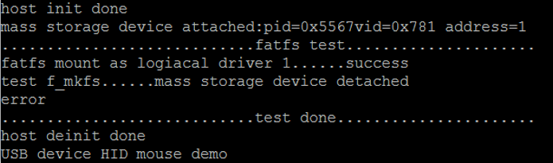

# pin_detect_hid_msd

## Overview

This pin detect HID MSD example can become a HID mouse device or a MSD host that supports U-disk. 
  The application prints the operation information when the U-disk is attached or is plugged into the PC host.

## System Requirement

### Hardware requirements

- Mini/micro USB cable
- USB A to micro AB cable
- Hardware (Tower module/base board, and so on) for a specific device
- Personal Computer

### Software requirements

- The project files are in: 
  <MCUXpresso_SDK_Install>/boards/<board>/usb_examples/usb_pin_detect_hid_msd/<rtos>/<toolchain>.
> The <rtos> is Bare Metal or FreeRTOS OS.

## Getting Started

### Hardware Settings

For detailed instructions, see the appropriate board User's Guide.
> The jumpers of the hardware (Tower system/base module) needs to be set to default setting at first.

### Prepare the example 

1.  Download the program to the target board.
2.  Power off the target board and power on again, or press the reset button on your board.

> For detailed instructions, see the appropriate board User's Guide.

## Run the example

1. Connect the board UART to the PC and open the COM port in a terminal tool.
2. Run the pin_detect_hid_msd example. The board now acts as an USB device mouse and a USB switch-to-device mode information is displayed.
3. Plug in an U-disk to the test board. The board acts as an USB host. The stack switches to host mode and makes some read/write operations of file system.
   Meanwhile, some attached-device and the related operation information are printed out. 
4. Unplug the mouse with the cable. The board now acts as a USB device mouse. The mouse is detached and the USB switches to the device mode information.
6. Plug in the mouse device into the PC. An HID-compliant mouse is enumerated in the Device Manager.
7. The mouse arrow is moving on the PC screen in a rectangular rotation.

The following figures show a pin detect msd information for the pin detect hid msd demo.

> Because the printed information is much long, so the U-disk been plugged out in advance.

 

## Supported Boards
- MIMXRT1170-EVKB
- EVK-MIMXRT1010
- [MCX-N5XX-EVK](../../_boards/mcxn5xxevk/usb_examples/usb_pin_detect_hid_msd/example_board_readme.md)
- [MCX-N9XX-EVK](../../_boards/mcxn9xxevk/usb_examples/usb_pin_detect_hid_msd/example_board_readme.md)
- EVK-MIMXRT1064
- MIMXRT1060-EVKC
- MIMXRT1040-EVK
- EVKB-IMXRT1050
- MIMXRT1024-EVK
- [FRDM-MCXN947](../../_boards/frdmmcxn947/usb_examples/usb_pin_detect_hid_msd/example_board_readme.md)
- FRDM-RW612
- MIMXRT1160-EVK
- MIMXRT1180-EVK
- RD-RW612-BGA
- EVK-MIMXRT1020
- EVK-MIMXRT1015
- [FRDM-MCXN236](../../_boards/frdmmcxn236/usb_examples/usb_pin_detect_hid_msd/example_board_readme.md)
- MIMXRT1060-EVKB
