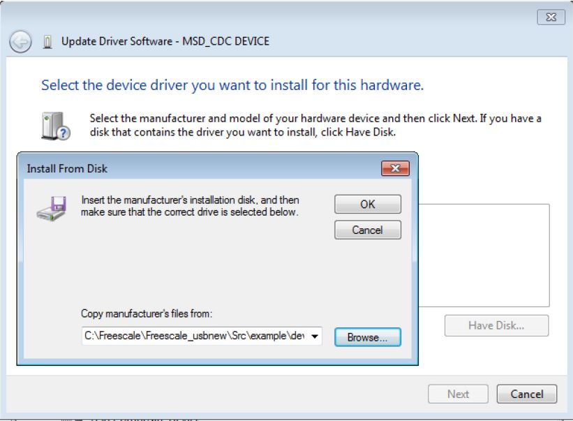
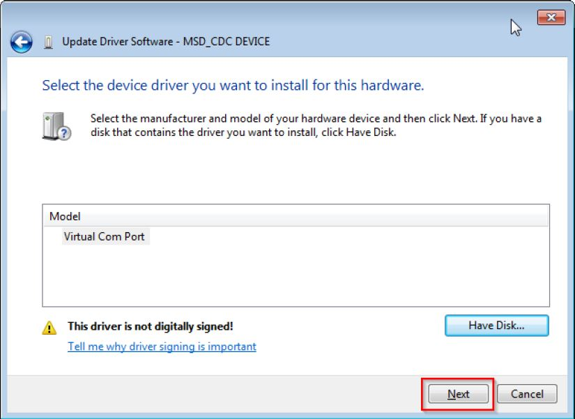

# dev_composite_cdc_msc_disk_lite_bm

## Overview

The Composite CDC_MSC project is a simple demonstration program based on the MCUXpresso SDK.  
It is enumerated as a COM port and a U-disk. The COM  port can be opened using terminal tools, such as TeraTerm. 
The demo echoes back any character it receives. Users can read and write the EMMC as a standard U-disk.
The purpose of this demo is to show how to build a composite USB device and to provide a simple example for further development.

## System Requirement

### Hardware requirements

- Mini/micro USB cable
- USB A to micro AB cable
- Hardware (Tower module/base board, and so on) for a specific device
- Personal Computer

### Software requirements

- The project files are in: 
  <MCUXpresso_SDK_Install>/boards/<board>/usb_examples/usb_device_composite_cdc_msc_disk/<rtos>/<toolchain>.
  For a lite version, the project files are in: 
  <MCUXpresso_SDK_Install>/boards/<board>/usb_examples/usb_device_composite_cdc_msc_disk_lite/<rtos>/
<toolchain>.
> The <rtos> is Bare Metal or FreeRTOS OS.

## Getting Started

### Hardware Settings

> Set the hardware jumpers (Tower system/base module) to default settings.

### Prepare the example 

1.  Download the program to the target board.
2.  Connect the target board to the external power source (the example is self-powered).
3.  Either press the reset button on your board or launch the debugger in your IDE to begin running
    the demo.
4.  Connect a USB cable between the PC host and the USB device port on the board.

> For detailed instructions, see the appropriate board User's Guide.

## Run the example in Windows

1.  A COM port and a USB Mass Storage Device is enumerated in the Device Manager. 
If it prompts for CDC driver installation, see the next section to install the CDC driver.
2.  Open the COM port in a terminal tool, such as the Tera Term.
3.  Type some characters, which are echoed back from the COM port.
 
4.  The Windows OS prompts to scan the U disk.
 
the computer will display the capacity of removable disk.
 

note 
-  Because there is no dynamic detection between the host and the device, the COM port must be closed from the terminal tool prior to unplugging the CDC device. 
Otherwise, the CDC device won't get recognized next time that it is plugged in with the COM port still opened.
-  If no hardware FLOW CONTROL is needed, let the variable start_transactions always be TRUE.
-  The RAM disk and EMMC disk function can't be enabled at the same time.
-  The USB_DEVICE_MSC_READ_BUFF_SIZE and USB_DEVICE_MSC_WRITE_BUFF_SIZE macros limit the device identification and data transfer speed. 
   The larger the buffer size, the faster the data transfer speed.
   The buffer size should be a multiple of 512 with the smallest value being 512. 
   The USB DISK example has the following work mode. Note that different modes have different throughputs:
        1. The USB_DEVICE_CONFIG_USE_TASK is not enabled and the value is zero. 
  The USB DISK example USB_DeviceMscCallback function  works in the USB IRQ handle function.
        2. The USB_DEVICE_CONFIG_USE_TASK is enabled. The USB DISK example code works in task mode.
  USB_DeviceMscCallback is called in the task. In this use case,
          the throughput is lower than the throughput in use case 1.
        3. The USB_DEVICE_CONFIG_USE_TASK and USB_DEVICE_MSC_USE_WRITE_TASK are enabled. The write is used to optimize the throughput and the throughput is almost 
           the same as in use case 1.
        4. The USB_DEVICE_CONFIG_USE_TASK is not enabled and the USB_DEVICE_MSC_USE_WRITE_TASK is enabled. This use case is not allowed.

## Installing the CDC driver for virtual_com and msd_cdc composite example
Below are the steps to install the CDC driver on Windows 7 OS. Similar process applies to Windows XP OS.

Step 1. Click "Update Driver Software..."

 

Step 2. Choose "Browse..."

 

Step 3. Select "Let me pick..."

 

Step 4. Navigate to your CDC driver location.

<install_dir>\\boards\\<board>\\usb_examples\\usb_device_composite_cdc_msc_disk\\inf

or

<install_dir>\\boards\\<board>\\usb_examples\\usb_device_composite_cdc_msc_disk_lite\\inf

 

Step 5. Press "Next".

 

Step 6. Ignore the warning and press "Yes".

 

Step 7. Now the CDC driver should be installed successfully.

 

- If the driver signature issue occurs on Windows 8 OS, see the link,\n
[Disabling Driver Signature on Windows 8](https://learn.sparkfun.com/tutorials/disabling-driver-signature-on-windows-8/disabling-signed-driver-enforcement-on-windows-8)
- To enable driver signing on Windows OS, see the link,
  + <a href="msdn.microsoft.com/en-us/library/windows/hardware/ff544865(v=vs.85.aspx)">Driver Signing</a>
  + [Practical Windows Code and Driver Signing](http://www.davidegrayson.com/signing/#howto)

*/

## Supported Boards
- MIMXRT1170-EVKB
- LPCXpresso55S69
- EVK-MIMXRT1064
- MIMXRT685-AUD-EVK
- LPCXpresso54S018
- LPCXpresso54S018M
- MIMXRT1060-EVKB
- MIMXRT1040-EVK
- FRDM-MCXN947
- MIMXRT1024-EVK
- LPCXpresso55S28
- LPCXpresso54628
- MCX-N5XX-EVK
- MIMXRT1060-EVKC
- MIMXRT1160-EVK
- MIMXRT1180-EVK
- EVK-MIMXRT1020
- MIMXRT700-EVK
- EVK-MIMXRT595
- EVK-MIMXRT685
- MCX-N9XX-EVK
- EVKB-IMXRT1050
