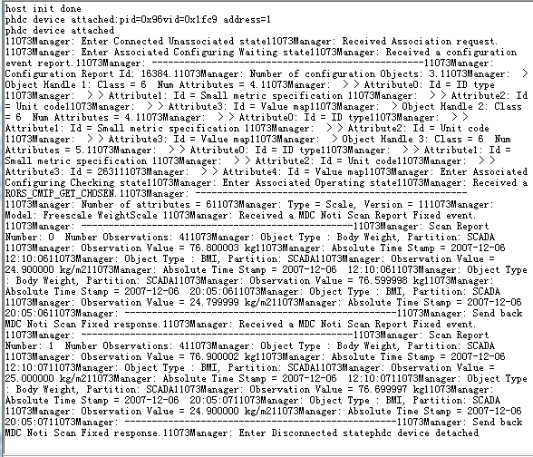

# dev_phdc_weighscale

## Overview

The USB PHDC WeighScale application is a simple demonstration program based on the MCUXpresso SDK.
It is enumerated as a weight scale device and the HealthLink software is used to interact with this
device to simulate the personal weight scale data, such as body mass and body mass index.

## System Requirement

### Hardware requirements

- Mini/micro USB cable
- USB A to micro AB cable
- Hardware (Tower module/base board, and so on) for a specific device
- Personal Computer (PC)

### Software requirements

- The project files for lite version example are in: 
  <MCUXpresso_SDK_Install>/boards/<board>/usb_examples/usb_device_phdc_weighscale_lite/<rtos>/<toolchain>.
   For non-lite version example, the path is: 
  <MCUXpresso_SDK_Install>/boards/<board>/usb_examples/usb_device_phdc_weighscale/<rtos>/<toolchain>.
> The <rtos> is Bare Metal or FreeRTOS OS.
- The HealthLink software installed in Personal Computer(PC)

## Getting Started

### Hardware Settings

> Set the hardware jumpers (Tower system/base module) to default settings.

### Prepare the example

1.  Download the program to the target board.
2.  Connect the target board to the external power source (the example is self-powered).
3.  Power off the target board. And then power on again.
4.  Connect a USB cable between the Host and the USB device port of the board.

> For detailed instructions, see the appropriate board User's Guide.
> this example could be tested with the "usb_host_phdc_manager" example in pairs.
## Run the example in Windows

1.  Prepare one board that run usb_host_phdc_manager example work as host.
2.  Prepare one target board which is running the "usb_device_phdc_weighscale" example to work as device, plug into the host .
    The state of the device and the received data will show up on host phdc serial terminal.Open the host serial terminal, the data received from device phdc will be printed as following.
    
 

*/

## Supported Boards
- MIMXRT1170-EVKB
- FRDM-K22F
- LPCXpresso55S69
- EVK-MIMXRT1064
- FRDM-MCXA153
- MIMXRT685-AUD-EVK
- FRDM-MCXA276
- LPCXpresso51U68
- LPCXpresso54S018
- [LPCXpresso55S16](../../_boards/lpcxpresso55s16/usb_examples/usb_device_phdc_weighscale/example_board_readme.md)
- LPCXpresso54S018M
- MIMXRT1060-EVKB
- EVK-MIMXRT1010
- MIMXRT1040-EVK
- FRDM-MCXN947
- MIMXRT1024-EVK
- LPCXpresso55S28
- LPCXpresso54628
- LPCXpresso55S36
- MCX-N5XX-EVK
- MIMXRT1060-EVKC
- MIMXRT1160-EVK
- MIMXRT1180-EVK
- [FRDM-K32L2A4S](../../_boards/frdmk32l2a4s/usb_examples/usb_device_phdc_weighscale/example_board_readme.md)
- EVK-MIMXRT1020
- MIMXRT700-EVK
- FRDM-MCXA156
- EVK-MIMXRT595
- EVK-MIMXRT685
- MCX-N9XX-EVK
- EVKB-IMXRT1050
- RD-RW612-BGA
- FRDM-K32L3A6
- EVK-MIMXRT1015
- FRDM-MCXN236
- FRDM-RW612
