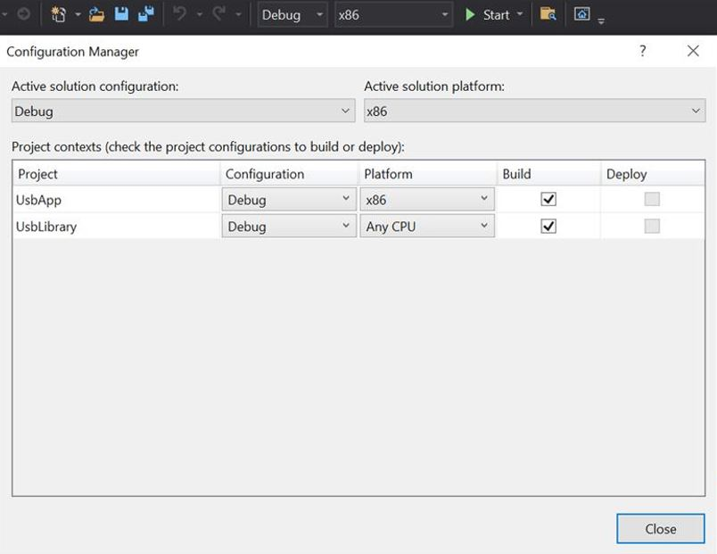
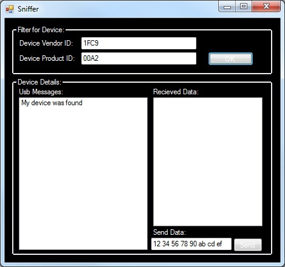
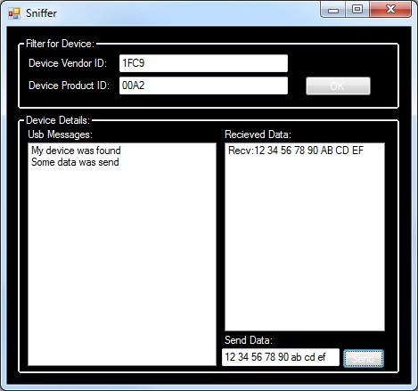

# dev_hid_generic_lite_bm


## Overview

The USB HID generic application is a simple demonstration program based on the MCUXpresso SDK.
It is enumerated as a HID-compliant device. A PC application can be used to exchange data with the device.

## System Requirement

### Hardware requirements

- Mini/micro USB cable
- USB A to micro AB cable
- Hardware (Tower module/base board, and so on) for a specific device
- Personal Computer (PC)


### Software requirements

- The project files for lite version examples are is:
<br> <MCUXpresso_SDK_Install>/boards/<board>/usb_examples/usb_device_hid_generic_lite/<rtos>/<toolchain>.
<br>  For non-lite version examples the path is:
<br> <MCUXpresso_SDK_Install>/boards/<board>/usb_examples/usb_device_hid_generic/<rtos>/<toolchain>.
> The <rtos> is Bare Metal or FreeRTOS OS.

- The PC's test tool is generated based on Wimar's USB HID Component for C#. The source code link is:
<br> www.codeproject.com/Articles/18099/A-USB-HID-Component-for-C
<br> To support the USB HID generic device, make these updates in the file "Sniffer.cs".
1. Function `usb_OnSpecifiedDeviceArrived` \n
This function is updated as follows :\n
```
        private void usb_OnSpecifiedDeviceArrived(object sender, EventArgs e)
        {
            this.lb_message.Items.Add("My device was found");
            this.tb_send.Text = "12 34 56 78 90 ab cd ef";
        }
```

2. Function `btn_send_Click` \n
This function is updated as follows :\n
```

        private void btn_send_Click(object sender, EventArgs e)
        {
            try
            {
                string text = this.tb_send.Text + " ";
                int length = 0;
                text = new System.Text.RegularExpressions.Regex("[\\s]+").Replace(text, " ");
                text.Trim();
                string[] arrText = text.Split(' ');
                byte[] data = new byte[arrText.Length];
                for (int i = 0; i < (arrText.Length); i++)
                {
                    if (arrText[i] != "")
                    {
                        int value = Int32.Parse(arrText[i], System.Globalization.NumberStyles.AllowHexSpecifier);
                        data[i] = (byte)Convert.ToByte(value);
                        length++;
                    }
                }

                for (int i = 0;i < length;i = i+this.usb.SpecifiedDevice.OutputReportLength-1)
                {
                    byte[] send_buffer = new byte[this.usb.SpecifiedDevice.OutputReportLength];
                    send_buffer[0] = (byte)0;
                    for(int j = 1; (j < (data.Length - i + 1)) && (j < this.usb.SpecifiedDevice.OutputReportLength);j++)
                    {
                        send_buffer[j] = data[j + i - 1];
                    }
                    if (this.usb.SpecifiedDevice != null)
                    {
                        this.usb.SpecifiedDevice.SendData(send_buffer);
                    }
                    else
                    {
                        MessageBox.Show("Sorry but your device is not present. Plug it in!! ");
                    }
                }
            }
            catch (Exception ex)
            {
                MessageBox.Show(ex.ToString());
            }
        }
```

3. Function `usb_OnDataRecieved` \n
This function is updated as follows :\n
```

        private void usb_OnDataRecieved(object sender, DataRecievedEventArgs args)
        {
            if (InvokeRequired)
            {
                try
                {
                    Invoke(new DataRecievedEventHandler(usb_OnDataRecieved), new object[] { sender, args });
                }
                catch (Exception ex)
                {
                    Console.WriteLine(ex.ToString());
                }
            }
            else
            {
                string rec_data = "Recv:";
                int is_report_id = 1;
                foreach (byte myData in args.data)
                {
                    if (is_report_id > 0)
                    {
                        is_report_id = 0;
                    }
                    else
                    {
                        rec_data += myData.ToString("X2") + " ";
                    }
                }
                this.lb_read.Items.Insert(0, rec_data);
            }
        }
```


## Getting Started

### Hardware Settings

> Set the hardware jumpers (Tower system/base module) to default settings.


### Prepare the example

1.  Download the source code of the PC test tool, apply the changes and rebuild the test tool projects.
> For X64 OS, the CPU platform should be selected to x86 in project.
<br>
2.  Connect the target board to the external power source (the example is self-powered).
3.  Download the program to the target board.
4.  Power off the target board. And then power on again.
5.  Connect a USB cable between the PC and the USB device port of the board.

> For detailed instructions, see the appropriate board User's Guide.
> this example could also be tested with the "usb_host_hid_generic" example in pairs.
## Run the example

1.  Plug in the device, which is running HID generic example, into the PC. An HID-compliant device is enumerated in the Device Manager.
2.  Run the test tool. Set the Vendr ID (VID) to "1FC9" and Product ID (PID) to "00A2". Then click the "OK" button.\n
If the device is found and opened, the message "My device was found" is shown in the text box "USB Messages".
<br>
> The VID and PID is Hex format.

3.  Enter the data in the text box "Send data" and click the "Send" button. If data is sent, the message "Some data was sent" is shown in the text box "USB Messages".
Then, the device sends back the data. When the data is received, the received data is shown in text box "receive data".\n
For example, data "12 34 56 78 90 ab cd ef" is sent to the device. The message "Recv: 12 34 56 78 90 ab cd ef" is shown when the test tool receives the data.
<br>
> The data is in a hexadecimal format.


*/


## Supported Boards
- MIMXRT1170-EVKB
- FRDM-MCXC444
- FRDM-K22F
- LPCXpresso55S69
- EVK-MIMXRT1064
- FRDM-MCXA153
- MIMXRT685-AUD-EVK
- FRDM-MCXA276
- LPCXpresso51U68
- LPCXpresso54S018
- LPCXpresso55S16
- FRDM-K32L2B
- LPCXpresso54S018M
- MIMXRT1060-EVKB
- EVK-MIMXRT1010
- MIMXRT1040-EVK
- FRDM-MCXN947
- MIMXRT1024-EVK
- LPCXpresso55S28
- LPCXpresso54628
- LPCXpresso55S36
- MCX-N5XX-EVK
- MIMXRT1060-EVKC
- MIMXRT1160-EVK
- MIMXRT1180-EVK
- FRDM-K32L2A4S
- EVK-MIMXRT1020
- MIMXRT700-EVK
- FRDM-MCXA156
- EVK-MIMXRT595
- EVK-MIMXRT685
- FRDM-MCXC242
- MCX-N9XX-EVK
- EVKB-IMXRT1050
- RD-RW612-BGA
- FRDM-K32L3A6
- EVK-MIMXRT1015
- FRDM-MCXN236
- FRDM-RW612
