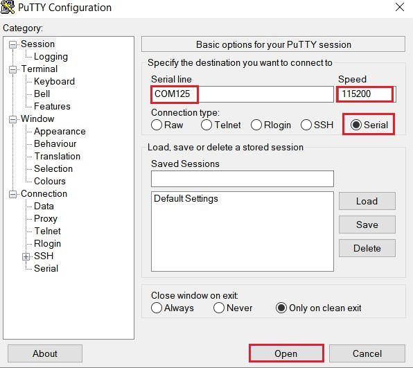

# host_audio_unified

## Overview

The Host Audio example supports the audio microphone and speaker (unified) device.
  The application prints the audio microphone and speaker information when the USB audio unified device is attached. For an audio device that only support microphone or speaker, this example does not support.

## System Requirement

### Hardware requirements

- Mini/micro USB cable
- USB A to micro AB cable
- Hardware (Tower module/base board, and so on) for a specific device
- Personal Computer

### Software requirements

- The project files are in: 
  <MCUXpresso_SDK_Install>/boards/<board>/usb_examples/usb_host_audio_unified/<rtos>/<toolchain>.
> The <rtos> is Bare Metal or FreeRTOS OS. The host can't totally guarantee getting all of stream data of audio device on some platforms because some SOCs' performance may not meet this case's requirement. If the ISO out endpoint interval of device is 125us, host may not have enough performance to handle transfer so that noise may occurs. 

## Getting Started

### Hardware Settings

For detailed instructions, see the appropriate board User's Guide.
> Set the hardware jumpers (Tower system/base module) to default settings.

### Prepare the example 

1.  Download the program to the target board.
2.  Power off the target board, and then power on again or press the reset button on your board.
3.  Connect the  USB audio speaker devices to the board.

> For detailed instructions, see the appropriate board User's Guide.

## Run the example

1.  Connect the board UART to the PC, you can see the Serial port number from "Device Manager", then open the
COM port in a terminal tool such as PuTTy as the following picture, the baud rate is 115200.
 
 
3.  Make sure to use a USB HUB or an adapter with OTG functionality firstly. Plug in the USB audio unified (microphone and speaker) device to the board and the related information is printed in the
terminal.
4.  After the USB audio unified device is plugged into the host, the USB application automatically gets the audio data from the 
USB audio microphone of this device then transfers the recorded audio data to the USB audio speaker of this device. At this time, the
sound can be heard from the audio speaker of this device.
The following image shows how to attach a USB audio unified device.
  device")
  device")

> 1. If audio device is a microphone-only or speaker-only device, host doesn't support. It means that device must be a microphone + speaker (unified) device.
> 2. If the sample rate of audio device is different for microphone and speaker, host doesn't support.
> 3. Even though the sample rate is same, if both the bit width and channel count are different, host doesn't support.
> 4. If the bit width or channel count is different, host does some adjustment for recording audio data of micrphone to make speaker plays audio normally.

  the following are the USB audio devices tested.
      (1) UGREEN type:US205
      (2) BOYA BY-EA2S
      (3) Jabra Evolve2 40    
      (4) evkmimxrt1170 which is running dev_composite_hid_audio_unified_bm demo in our SDK.
      (5) Texas Instruments Japan, PCM2902 Audio codec.

## Supported Boards
- EVK-MIMXRT1064
- MIMXRT685-AUD-EVK
- [LPCXpresso55S16](../../_boards/lpcxpresso55s16/usb_examples/usb_host_audio_unified/example_board_readme.md)
