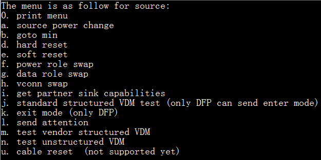

# usb_pd

## Overview

This PD example is a simple demonstration based on the MCUXpresso SDK PD stack.
  The application use the board keys and debug console to test the PD functions.
  The demo works as DRP. When connect, the board can be source or sink.

## System Requirement

### Hardware requirements

- Two Type-C shield boards
- Two 9V DC power suppliers
- Type-C Cable
- Two hardwares (Tower module/base board, and so on) for a specific device, for example: two lpcxpresso54114 boards
- Personal Computer

### Software requirements

- The project files are in: 
  <MCUXpresso_SDK_Install>/boards/<board>/usb_examples/usb_pd/<rtos>/<toolchain>.
> The <rtos> is Bare Metal or FreeRTOS OS.
- Terminal tool.

## Getting Started

### Hardware Settings

  For detailed instructions, see the appropriate board User's Guide.
> Set the hardware jumpers (Tower system/base module) to default settings.

### Prepare the example

1.  For MCUXpresso, please reference to the MCUXpresso SDK USB Type-C PD Stack User's Guide to make sure the SDK_DEBUGCONSOLE = 1 in project settings.
2.  Download the program to the target board.
3.  Power on Type-C shield board then power on development board.

## Run the example

1.  Download this program to two boards, connect these two boards with Type-C cable.
2.  Connect two boards' OpenSDA USB port to the PC and open terminal.
3.  Request power from sink role.
    - Long press "Power request SW" for about 3s on the board to make 9V request. After the request is completed successfully, the VBus voltage is 9V.
    - Short press "Power request SW" on the board to make 5V request. After the request is completed successfully, the VBus voltage is 5V.
4.  Power swap
    - Short press "Power change SW" on the board to make PR_SWAP.
    - The Voltage of the vbus will drop to 0V and then back to 5V.
    - After success, the power roles are changed.
5.  Hard reset
    - Long press "Power change SW" on the board to make HARD_RESET.
    - The Voltage of the vbus will drop to 0V and then back to 5V.
    - Source and sink state machine will re-start and sink will request power again, you can see the logs in the debug console.
6.  Test other commands
    - Input '0' in the debug console, the follow menu will print in the debug console (the menu is little different for source and sink):
 
    - Input the menu to test the corresponding command.
    - For example: you input 'g', "data role swap" command will start, the debug console will print the result.
7.  Some boards' default configuration is PD2.0. To test the PD3.0 command, PD_CONFIG_REVISION need be changed from PD_SPEC_REVISION_20 to PD_SPEC_REVISION_30 in usb_pd_config.h file.
    Then input '0' in the debug console, some PD3.0 related commands menu are added.
8.  For compliance test, PD_CONFIG_COMPLIANCE_TEST_ENABLE, PD_CONFIG_TRY_SNK_SUPPORT and PD_CONFIG_TRY_SRC_SUPPORT need be enable in usb_pd_config.h.
    There are five compliance test configurations in this demo: PD_COMPLIANCE_TEST_DRP, PD_COMPLIANCE_TEST_DRP_TRY_SNK, PD_COMPLIANCE_TEST_DRP_TRY_SRC, PD_COMPLIANCE_TEST_CONSUMER_PROVIDER and PD_COMPLIANCE_TEST_PROVIDER_CONSUMER. There are five VIF files in the VIF directory corresponding to these five configurations.
9.  This demo support the auto policy feature test. There is one MACRO (PD_TEST_ENABLE_AUTO_POLICY) in pd_board_config.h file.
    It can be configured with five values:
    0 - disable auto policy
    1 - enable auto policy, the behaviors are: don't auto request, auto accept all request for pr swap, data swap and vconn swap
    2 - enable auto policy, the behaviors are: auto request pr swap when works as sink, auto accept for swap to source/DFP/vconn source, auto reject for swap to sink/UFP/not vconn source, auto request power when working as sink;
    3 - enable auto policy, the behaviors are: auto request data swap to DFP, auto accept for swap to sink/UFP/not vconn source, auto reject for swap to source/DFP/vconn source
    4 - enable auto policy, the behaviors are: auto request vconn swap to vconn source, auto reject all request for pr swap, data swap and vconn swap.

> After enable PD3.0 some target of USB PD demo can't build pass for a few boards because of board flash or ram code size limitation.

## Supported Boards
- MIMXRT1170-EVKB
- FRDM-K22F
- LPCXpresso55S69
- EVK-MIMXRT1064
- MIMXRT685-AUD-EVK
- LPCXpresso55S16
- MIMXRT1060-EVKB
- MIMXRT1040-EVK
- FRDM-MCXN947
- MIMXRT1024-EVK
- LPCXpresso55S28
- LPCXpresso55S36
- MCX-N5XX-EVK
- MIMXRT1060-EVKC
- MIMXRT1160-EVK
- MIMXRT1180-EVK
- FRDM-K32L2A4S
- EVK-MIMXRT1020
- MIMXRT700-EVK
- EVK-MIMXRT595
- EVK-MIMXRT685
- MCX-N9XX-EVK
- EVKB-IMXRT1050
- EVK-MIMXRT1015
- FRDM-MCXN236
