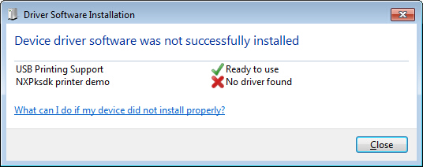
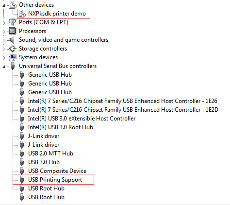
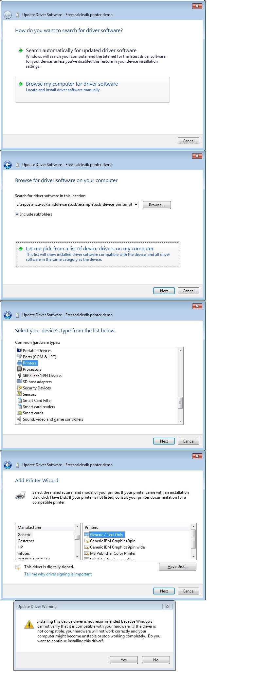
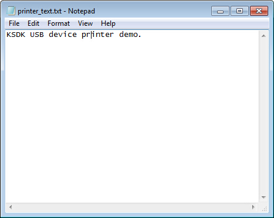
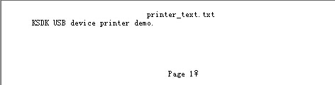
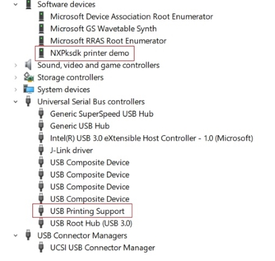
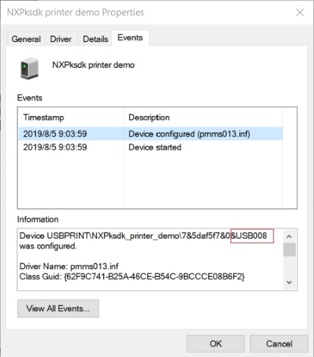
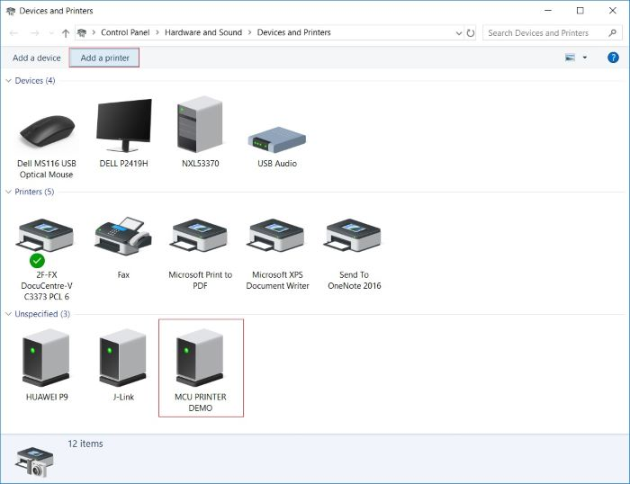
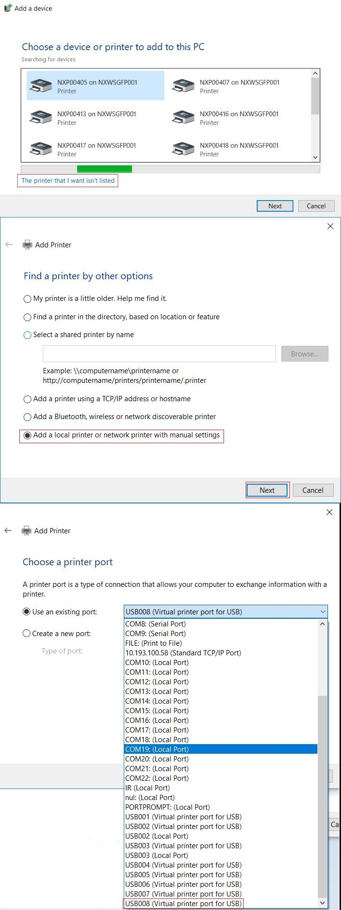
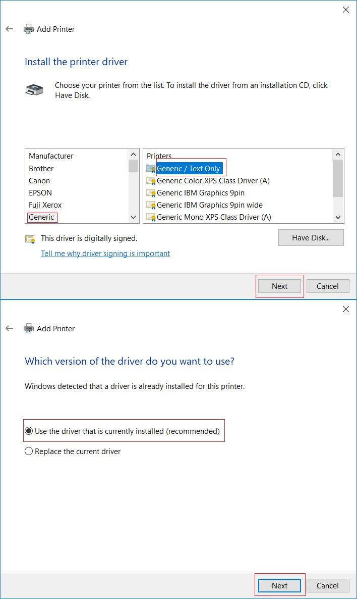

# dev_printer_virtual_plain_text

## Overview

The USB virtual printer application is a simple application to demonstrate a virtual printer functionality.
Because there is no printer language parsing, the received raw data is output directly in the debug console.
As a result, only plain text is suitable for testing. For other printer language support, such as postscript, implement the corresponding parser.

## System Requirements

### Hardware requirements

- Mini/micro USB cable
- USB A to micro AB cable
- Hardware (Tower module/base board, and so on) for a specific device
- Personal Computer (PC)

### Software requirements

- The project files for lite version examples are in: 
  <MCUXpresso_SDK_Install>/boards/<board>/usb_examples/usb_device_printer_virtual_plain_text_lite/<rtos>/<toolchain>.
   For non-lite version example, the path is: 
  <MCUXpresso_SDK_Install>/boards/<board>/usb_examples/usb_device_printer_virtual_plain_text/<rtos>/<toolchain>.
> The <rtos> is Bare Metal or FreeRTOS OS.

## Getting Started

### Hardware Settings

> Set the hardware jumpers (Tower system/base module) to default settings.

### Prepare the example

1.  Download the program to the target board.
2.  Connect the target board to the external power source (the example is self-powered).
3.  Power off the target board. Then power on again.
4.  Connect a USB cable between the PC and the USB device port of the board.

> For detailed instructions, see the appropriate board User's Guide.

## Run the example on Windows7

1.  Plug in the device, which is running the printer example, into the PC.
2.  Wait for the PC to auto-install the driver. When the PC completes the installation, no driver is found as follows:
 
Opening the device manager, these devices are shown:
 
3.  Test generic printer driver. Right click the device in "Other devices" group, select "Update Driver Software...",
select "Browse my computer for driver software", select "Let me pick from a list of device drivers on my computer",
select "Printers", select "Generic" & "Generic / Text Only", and click on "Next" and "Yes" to install.
 
4.  After installing the driver, the "Generic / Text Only" printer  is available in the "Devices and Printers"
5.  Print one text file using this printer. 
 
The debug console data is as follows:
 

## Run the example on Windows10

1.  Plug in the device, which is running the printer example, into the PC.
2.  Wait for the PC to auto-install the driver. When the PC completes the installation, opening the device manager, these devices are shown:
 
3.  Right click on the NXPksdk printer demo and select "Properties", in the pop-up window, select the "Events" and find the configured port.
 
4.  In Control Panel, open the "Devices and Printers" window, click "Add a printer".
 
5.  In pop-up window, select "The printer that I want isn't listed", select "Add a local printer or network printer with manual settings",
select the port that showed in previous "Events" tab, select "Generic" & "Generic / Text Only", select "use the driver that is currently installed",
and click on "Next" and "Yes" to install.
 
 
6.  After above steps, a "Generic/Text Only" printer is available in "Devices and Printers".
7.  Print one text file using this printer.
 
The debug console data is as follows:
 
8.  Test postscript printer driver. Right click the "USB printing Support" and select "Uninstall". Unplug and plug in again.
9.  Wait for the PC to install the driver as in step 2.
10.  In Control Panel, open the "Devices and Printers" window, click "Add a printer",
In pop-up window, select "The printer that I want isn't listed", select "Add a local printer or network printer with manual settings",
select the port that showed in previous "Events" tab, select "Microsoft" & "Microsoft PS Class Driver", select "use the driver that is currently installed",
and click on "Next" and "Yes" to install.
11.  Print one text file using this printer. For example, if printing the same file as in step 7, the postscript data is displayed in the debug console.
The demo does not parse the data and outputs it to the debug console directly.

*/

## Supported Boards
- MIMXRT1170-EVKB
- FRDM-K22F
- LPCXpresso55S69
- EVK-MIMXRT1064
- FRDM-MCXA153
- MIMXRT685-AUD-EVK
- FRDM-MCXA276
- LPCXpresso51U68
- LPCXpresso54S018
- LPCXpresso55S16
- LPCXpresso54S018M
- MIMXRT1060-EVKB
- EVK-MIMXRT1010
- MIMXRT1040-EVK
- FRDM-MCXN947
- MIMXRT1024-EVK
- LPCXpresso55S28
- LPCXpresso54628
- LPCXpresso55S36
- MCX-N5XX-EVK
- MIMXRT1060-EVKC
- MIMXRT1160-EVK
- MIMXRT1180-EVK
- FRDM-K32L2A4S
- EVK-MIMXRT1020
- MIMXRT700-EVK
- FRDM-MCXA156
- EVK-MIMXRT595
- EVK-MIMXRT685
- MCX-N9XX-EVK
- EVKB-IMXRT1050
- RD-RW612-BGA
- FRDM-K32L3A6
- EVK-MIMXRT1015
- FRDM-MCXN236
- FRDM-RW612
