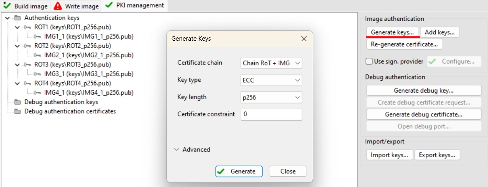
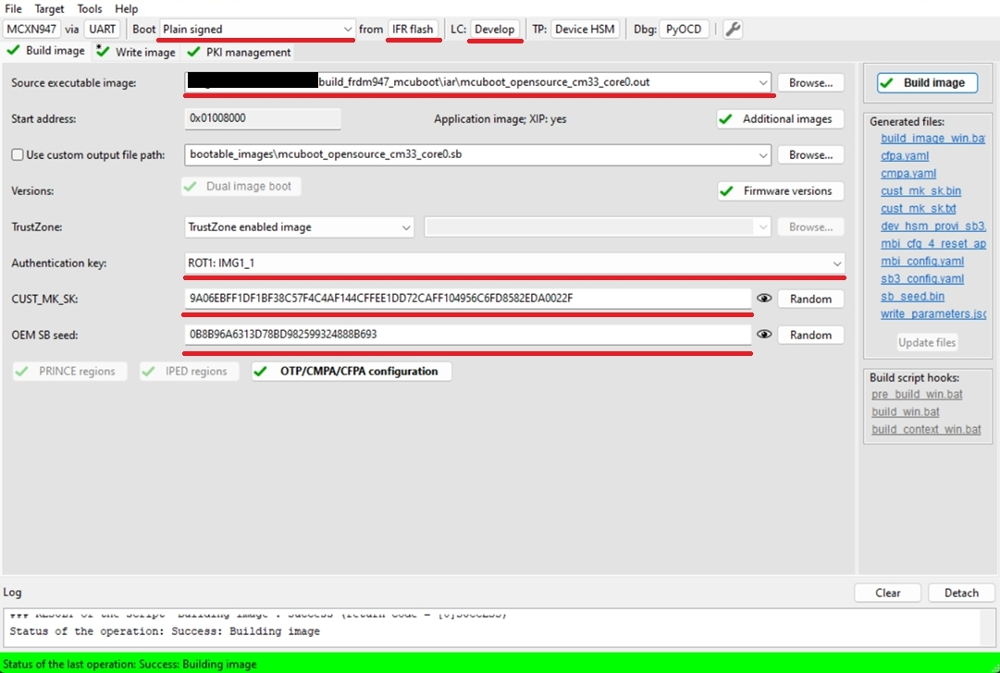
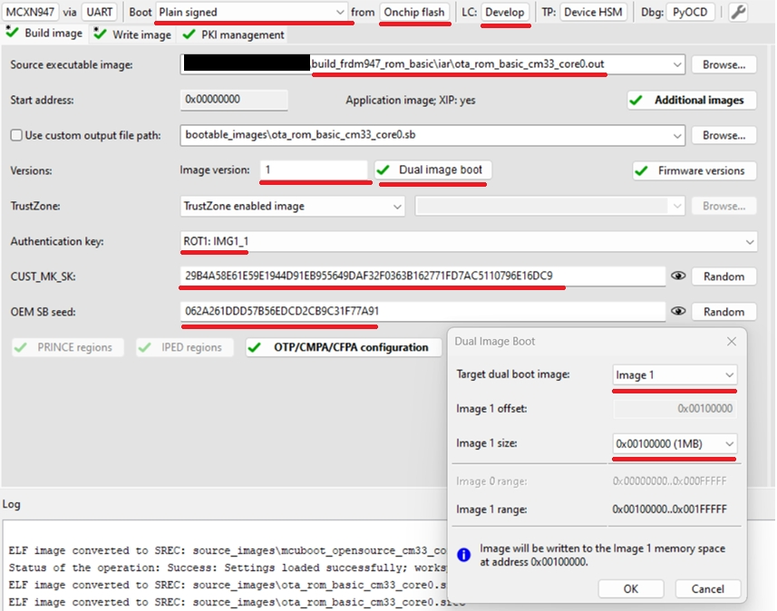
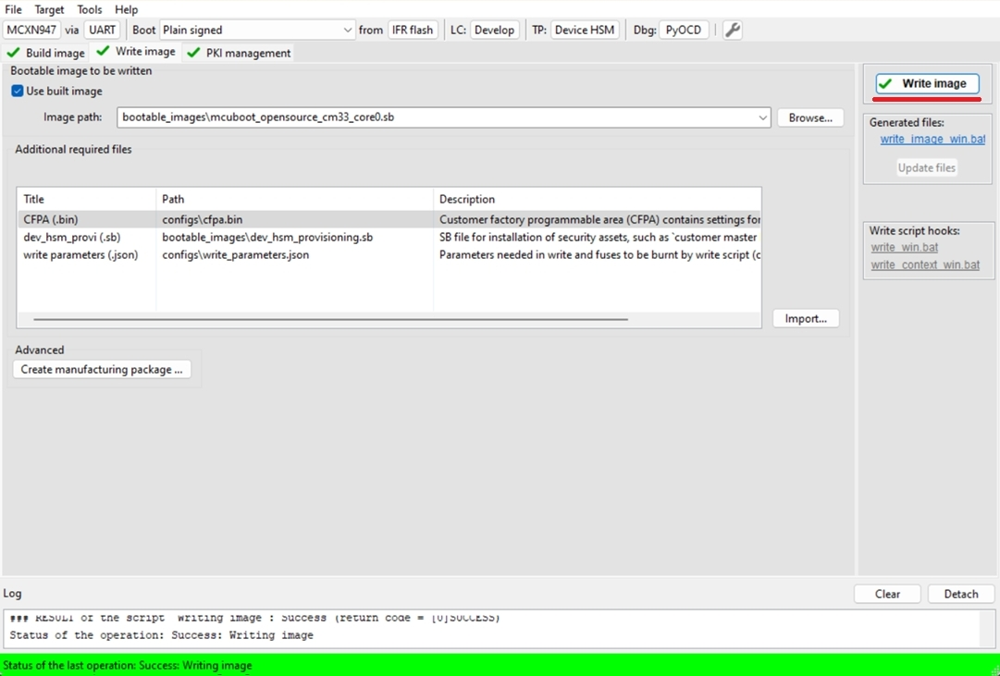
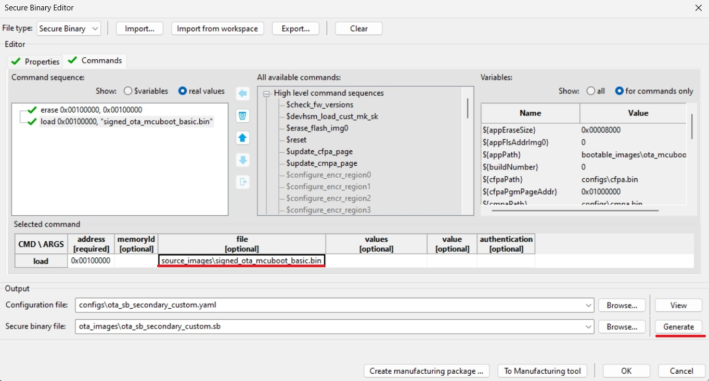
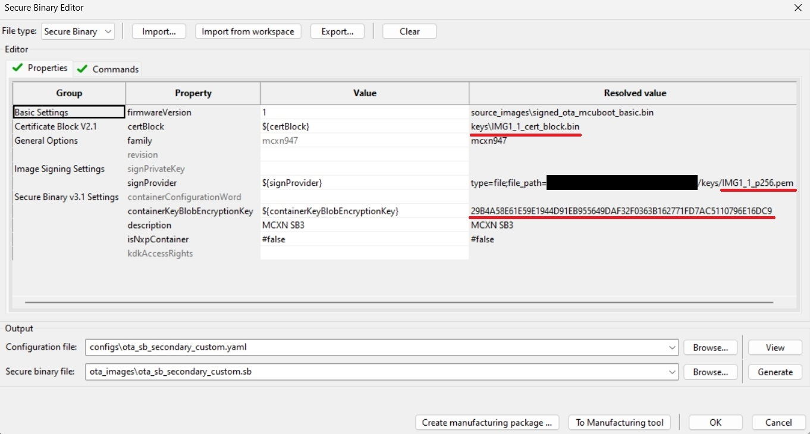

# MCXN - OTA update by using SB3 file

- [MCXN - OTA update by using SB3 file](#mcxn-ota-update-by-using-sb3-file)
   * [1. Provision the device](#1-provision-the-device)
   * [2. Prepare OTA images](#2-prepare-ota-images)
      + [2.1 ROM bootloader only use case](#21-rom-bootloader-only-use-case)
      + [2.2 MCUboot bootloader use case](#22-mcuboot-bootloader-use-case)
   * [3. Firmware update](#3-firmware-update)
      + [3.1 ROM bootloader only use case](#31-rom-bootloader-only-use-case)
      + [3.2 MCUboot bootloader use case](#32-mcuboot-bootloader-use-case)
   * [Supported Boards](#supported-boards)

In this walkthrough, if possible, the lifecycle of the device is not changed for development purposes, so the device can be restored to its initial state. In real scenarios, transitioning the chips to the corresponding lifecycle is based on specific requirements.

Common information related to SB3 is available in the documentation ['OTA update by using SB3 file'](sb3_common_readme.md).

## 1. Provision the device

The device must be provisioned to support SB3 processing. To simplify the workflow, the MCUXpresso Secure Provisioning Tool (SEC tool) is used.

To provision the device perform the following steps:

1. Erase the device
2. Build `mcuboot_opensource`+`ota_mcuboot_basic` or `ota_rom_basic` project depending what you want to evaluate
3. Get the device into ISP mode - typically on development boards hold the ISP button and press the reset button
4. Open the SEC tool and create new workspace for MCXN target device, test the ISP connection
5. Switch to PKI management tab
    * Click __Generate keys__ (leave default settings)

7. Build Image tab
    * Boot: __Plain signed__ from __IFR/Onchip flash__ based on `mcuboot_opensource` or `ota_rom_basic` location
    * Lifecycle: Develop
    * Select an __authentication key__ and generate __CUST_MK_SK__ and __OEM SB seed__
    * Enable Dual image support if you evaluate `ota_rom_basic`
        * Define Image version 1
        * Target dual boot image: __Image 1__
        * Image 1 size: 
            * For MCXN9xx/5xx select 0x100000 (1MB)
            * For MCXN2xx select 0x80000 (512kB)

Following image is for MCUboot use case

Following image is for ROM only use case

    
8. Click __Build image__ 

9. Write image tab
    * Click __Write image__

## 2. Prepare OTA images

### 2.1 ROM bootloader only use case

MCXN uses flash remapping based on swap mechanism so SB3 OTA file always target Image 1 memory region. 

1. Build Image tab
    * Increase Image version from 1 to 2
    * __Build image__
2. Rename generated SB3 file `bootable_images/ota_rom_basic.sb` to `ota_rom_basic_image_1_v2.sb`

### 2.2 MCUboot bootloader use case

1. Build `ota_mcuboot_basic` and sign image by `imgtool` as usual by following steps in specific `example_board_readme.md` for your board. Copy the signed binary to your $sec_tool_workspace/source_images
2. Look into [ota_examples/\_common/sb3_templates](../_common/sb3_templates) directory and copy SB3 configuration templates for your device to your $sec_tool_workspace/configs
    * MCXN: `mcxn_sb3_cfg_primary_slot.yaml`

3. In SEC tool open __Tools/SB Editor__ and click __Import__ to `sb3_config_mcxn_secondary_slot.yaml`
    * Check and eventually fix paths to keys and image binary
    * click __Generate__

Note: Optionally, we can also create initial SB3 file containing initial (first) `ota_mcuboot_basic` application for primary/secondary slot (generated with additional __`--pad --confirm`__ imgtool arguments) to simulate manufacturing process, otherwise the initial signed image can be also loaded directly using ISP or other preferred method as usual.

## 3. Firmware update

For demonstration purpose we use [ExtraPutty](https://sourceforge.net/projects/extraputty/) tool as this fork of classic Putty has XMODEM support. Alternatively [TeraTerm](https://teratermproject.github.io/index-en.html) can be used.

### 3.1 ROM bootloader only use case

1. Run initial `ota_rom_basic` application loaded in chapter 1.
    * Note: alternatively unsigned application via debug session using preferred IDE (IAR, MCUX, VSCode) - in this case the `image` command returns invalid information as there is no valid image header to parse

2. Check image state and active flag location with `image` command
    * See active flag location to specify inactive image slot

3. Send the OTA image
    * Run `xmodem_sb3` command
    * Send `ota_rom_basic_image_1_v2.sb` targetting inactive slot via __Files Transfer/Xmodem (1k)__ 

4. Reboot the device with `reboot` command

5. Check image update with `image` command

Here is an example of serial output:
~~~

*************************************
* Basic ROM application example     *
*************************************

$ image
Flash REMAP_SWAP disabled
IMAGE 0:
    <IMG_VERSION 0x1 LENGTH 36820 EXEC_ADDR 0x28004000>
    *ACTIVE*
IMAGE 1: Invalid image header
$ xmodem_sb3
Started xmodem processing SB3
Initiated XMODEM-CRC transfer. Receiving... (Press 'x' to cancel)
CCCC
Received 37880 bytes
SB3 has been processed
$
$ reboot
System reset!

*************************************
* Basic ROM application example     *
*************************************

$ image
Flash REMAP_SWAP active
IMAGE 0:
    <IMG_VERSION 0x1 LENGTH 36820 EXEC_ADDR 0x28004000>
IMAGE 1:
    <IMG_VERSION 0x2 LENGTH 36820 EXEC_ADDR 0x28004000>
    *ACTIVE*
$
~~~

### 3.2 MCUboot bootloader use case

1. Load and run initial `ota_mcuboot_basic` application as usual - alternatively load initial SB3 via `blhost` and `receive-sb-file` command.
    
2. Check image state and active flag location with `image` command
    * See active flag location to specify inactive image slot

2. Erase inactive slot with `image erase` command
    * Note: not needed if the SB file contains the erase command 

4. Send the OTA image
    * Run `xmodem_sb3` command
    * Send `ota_mcuboot_secondary_slot.sb` targetting inactive slot via __Files Transfer/Xmodem (1k)__ 

5. Mark installed image ready for test
    * Run `image test` command

6. Reboot the device with `reboot` command

7. Check image update with `image` command

8. Mark the updated slot with confirm flag using `image accept` and check the state again with `image` command again

~~~
hello sbl.
Bootloader Version 2.2.0
Primary   slot: version=1.0.0+1000
Image 0 Secondary slot: Image not found
Image 0 loaded from the primary slot
Bootloader chainload address offset: 0x40000
Reset_Handler address offset: 0x40400
Jumping to the image

Booting the primary slot - flash remapping is disabled

*************************************
* Basic MCUBoot application example *
*************************************

$ image
Image 0; name APP; state None:

  Slot 0 APP_PRIMARY; offset 0x0; size 0x100000 (1038576):
    <IMAGE: size 28828; version 1.0.0+1000>
    SHA256 of image payload: E069B6127A708EE88B39...
    log_addr 0x0
    *ACTIVE*

  Slot 1 APP_SECONDARY; offset 0x100000; size 0x100000 (1038576):
    <No Image Found>

$ image erase
Erasing inactive slot...done
$ xmodem_sb3
Started xmodem processing SB3
Make sure this device is provisioned to accept secure binary and its load address is 0x100000
Initiated XMODEM-CRC transfer. Receiving... (Press 'x' to cancel)
CCCCC
Received 51200 bytes
SB3 has been processed
$
$ image test
write magic number offset = 0x43ff00
$ reboot
System reset!
hello sbl.
Bootloader Version 2.2.0
Primary   slot: version=1.0.0+1000
Secondary slot: version=1.1.0+1000
writing copy_done; fa_id=1 off=0x1fffe0 (0x43ffe0)
Image 0 loaded from the secondary slot
Bootloader chainload address offset: 0x240000
Reset_Handler address offset: 0x240400
Jumping to the image

Booting the secondary slot - flash remapping is enabled

*************************************
* Basic MCUBoot application example *
*************************************

$ image
Flash REMAP_SWAP active.

Image 0; name APP; state Testing:

  Slot 0 APP_PRIMARY; offset 0x0; size 0x100000 (1038576):
    <IMAGE: size 28828; version 1.0.0+1000>
    SHA256 of image payload: E069B6127A708EE88B39...
    log_addr 0x0 remaps to 0x100000

  Slot 1 APP_SECONDARY; offset 0x100000; size 0x100000 (1038576):
    <IMAGE: size 28828; version 1.1.0+1000>
    SHA256 of image payload: E069B6127A708EE88B39...
    log_addr 0x100000 remaps to 0x0
    *ACTIVE*

$ image accept
$ image
Flash REMAP_SWAP active.

Image 0; name APP; state Permanent:

  Slot 0 APP_PRIMARY; offset 0x0; size 0x100000 (1038576):
    <IMAGE: size 28828; version 1.0.0+1000>
    SHA256 of image payload: E069B6127A708EE88B39...
    log_addr 0x0 remaps to 0x100000

  Slot 1 APP_SECONDARY; offset 0x100000; size 0x100000 (1038576):
    <IMAGE: size 28828; version 1.1.0+1000>
    SHA256 of image payload: E069B6127A708EE88B39...
    log_addr 0x100000 remaps to 0x0
    *ACTIVE*

$
~~~

## Supported Boards

- [FRDM-MCXN236](../../_boards/frdmmcxn236/ota_examples/mcuboot_opensource/example_board_readme.md)
- [FRDM-MCXN947](../../_boards/frdmmcxn947/ota_examples/mcuboot_opensource/example_board_readme.md)
- [MCX-N9XX-EVK](../../_boards/mcxn9xxevk/ota_examples/mcuboot_opensource/example_board_readme.md)