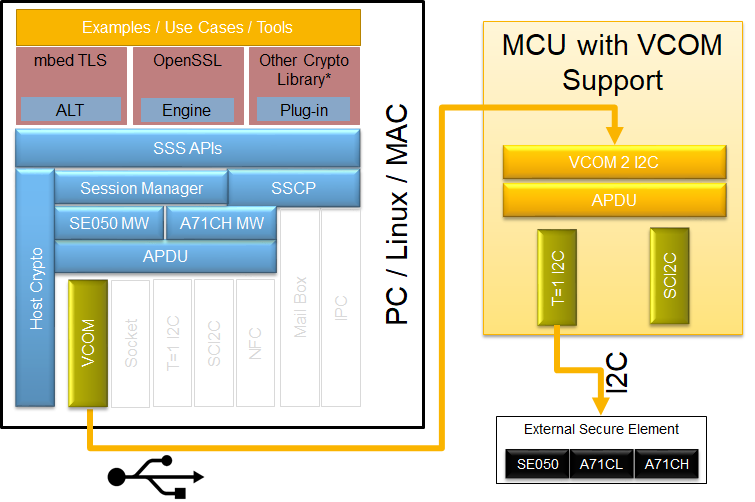
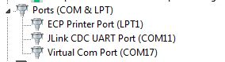

============================================================
 VCOM
============================================================

Virtual COM Port interface can be used to connect to the SE from
development PC/Laptop.   This gives advantage of faster turn around
time for devleopment and feature expermimentation.

.. note:: Drivers

    If the VCOM drivers are not installed on your PC, you would have to install it.

Also, for embdded platforms like :ref:`platform-frdm-k64f`, to run :ref:`cli-tool`

Steps to use VCOM for running the examples - PC & FRDM-K64F
-------------------------------------------------------------------

- Connect FRDM-K64F with, SE050 attached to it on, the USB Interface (Not the OpenSDA USB).

- FRDM-K64F should have the VCOM firmware. If not,

- Import vcomA71CH/vcomSE050  project into MCUXpresso. Build and download the VCOM firmware. For details on MCUxpresso Build and Debug,

- Open device manager, Under Ports (COM & LPT), look for the connected device.

- specify this COMport for connecting from PC. For e.g. ``COM17`` as per the above image.

.. note::

	It appears as "Virtual Com Port" or "USB Serial Device" based on the driver installed in the system.