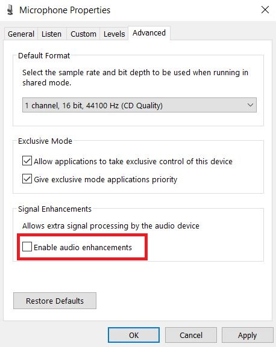

# dev_composite_audio_multi_ch_unified_lite_bm

## Overview

The USB composite audio multiple channel unified application is a multiple audio channels demonstration program based on the MCUXpresso SDK.
It is enumerated as a 16 channels playback and 16 channels recording device. Users can record the sound from this device via the "Sound Recorder" in the Windows Accessories and play music with the device by multiple channels.

## System Requirement

### Hardware requirements

- Mini/micro USB cable
- USB A to micro AB cable
- Specific hardware which has codec presented
- Personal Computer

### Software requirements

- The project files for the lite version example are in: 
  <MCUXpresso_SDK_Install>/boards/<board>/usb_examples/usb_device_composite_audio_multi_ch_unified_lite/<rtos>/
<toolchain>.
   The project files for a non-lite version example are in:
  <MCUXpresso_SDK_Install>/boards/<board>/usb_examples/usb_device_composite_audio_multi_ch_unified/<rtos>/
<toolchain>.
> The <rtos> is Bare Metal or FreeRTOS OS.

## Getting Started

### Hardware Settings

> Set the hardware jumpers (Tower system/base module) to default settings.

### Prepare the example

1.  Connect a USB cable between the PC host and the debugger USB port on the board to provide power supply (the example is self-powered).
2.  Download the program to the target board via IDE.
3.  Either press the reset button on your board or launch the debugger in your IDE to begin running the demo.
4.  Connect a USB cable between the PC host and the USB device port on the board.
5.  Demo start log is printed, note that the button name can be different for multiple boards.
 

For detailed instructions, see the appropriate board User's Guide.

## Run the example in Windows

> The mentioned steps can be different for Playback and Recording settings as per different Windows OS version.

1.  For the Audio recorder, a USB AUDIO+MULTI+CH DEMO device is enumerated in the Device Manager.
 
2.  Open the COM port in a terminal tool, such as the Putty.
3.  Right click on the sound control icon in the Start bar (near the clock) and select "Recording devices".
 
4.  In the opened window, select the "Microphone" device with the description "USB AUDIO + MULTI + CH DEMO" and click on the "Properties" button.
 
5.  In the new window, go to "Levels" tab, move the slide until 100%, and click on "OK". In "Advanced" tab, you can see channel number, bit width and sample rate of this recorder.
 
 
6.  Ensure that the selected "Microphone-USB AUDIO + MULTI + CH DEMO" is displayed as Default device if no other microphone device supported by the Windows system. If it's not mention as default device then click on the "Set default" option to make "Microphone-USB AUDIO + MULTI + CH DEMO" as a default device.
 
7.  Open the "Sound Recorder" application and record audio about 5-10 seconds.
8.  After recording, open the recorder file with any media player and verify it by listening on the speaker of Laptop/PC.
9.  In the opened window, select the "Speakers" device with the description "USB AUDIO + MULTI + CH DEMO" and click on the "Properties" button.
 
10.  In the new window, go to "Levels" tab, move the slide until 100%, and click on "OK".
 
11.  Ensure that the selected "Speakers-USB AUDIO + MULTI + CH DEMO" is displayed as Default device if no other speaker device supported by the Windows system. 
If it's not mention as default device then click on the "Set default" option to make "Speakers-USB AUDIO + MULTI + CH DEMO" as a default device. 
 
12.  Connect the earphone/headphone at Audio Line Out port of target board. There are multiple line out ports, you can use any one of them. Normally, the first two channels (channel 1, channel 2) are located to the line out port 1. Click "Configure" button, you can see the channel location. The total channel number is 16, but not all of channels are shown which means you can not see them but it exists actually. You can click one of channels to test it.
 
13.  Or Open the Window Media Player application, select and play your favorite song. If this song only has two channels, the audio data only can be heared from the line out port 1. You can also check that recorded audio is audible in the connected earphone/headphone at Audio Line Out port of target board.

note 
1.  On some platforms, the recorder may have noise since the audio clock and USB SOF are not synchronized, this problem only happens on Windows but not on Mac OSX since the latter uses unified engine.
2.  USB audio class 2.0 is enabled by default.
3.  Based on the USB spec, the feedback endpoint data length should be 3 bytes if the device is full speed. In this case, device can work on Mac OS. However, device can not work on Win 10 and feedback data length must be set 4. There is a workaround to fix this issue, please open the macro
USB_DEVICE_WORKAROUND_AUDIO_20_WINDOWS when meets the following conditions:
  - USB device is full speed and USB audio class 2.0 is enabled.
  - USB device uses feedback endpoint.
  - USB host is Windows 10.
4.  When device functionality is changed, such as USB auido class 2.0 or UAC 5.1, please uninstall the previous PC driver to make sure the device with changed functionality can run normally.  
5.  If you're having audio problems on Windows 10, please try to disable signal enhancement if it is present and enabled, then have a try again.
 

## Supported Boards
- MIMXRT685-AUD-EVK
