# dev_dfu


## Overview

The DFU project is a simple demonstration program based on the MCUXpresso SDK.  
It is enumerated as a dfu device, users can download one firmware to the dfu device with the tool called "dfu-util". 
the dfu example write the firmware content to flash or ram, and will check the CRC32 which stored in the last 4 byte of the firmware.
if the CRC32 check is right, then the dfu example will run the new firmware.Generally speaking, the firmware doesn't have CRC32. so
the following content will also introduce how to add CRC32 to the firmware.


## System Requirement

### Hardware requirements

- Mini/micro USB cable
- USB A to micro AB cable
- Hardware (Tower module/base board, and so on) for a specific device
- Personal Computer


### Software requirements
- The project files for lite version examples are is:
<br> <MCUXpresso_SDK_Install>/boards/<board>/usb_examples/usb_device_dfu_lite/<rtos>/<toolchain>.
<br>  For non-lite version examples the path is:
<br> <MCUXpresso_SDK_Install>/boards/<board>/usb_examples/usb_device_dfu/<rtos>/<toolchain>.
> The <rtos> is Bare Metal or FreeRTOS OS.

- The PC's test tool is dfu-util. The tool and source code link is:
<br> http://dfu-util.sourceforge.net/index.html

- All the release tool, source code and build instruction are in the upper link.
- For the release of the dfu-util software. please refer to the "Releases" chapter in the link and download the software according to your PC OS,
if your PC is windowa 64 bit, please download "dfu-util-0.9-win64.zip".
- For the source code and build instruction. please refer to the "Development" chapter in the link.

## Getting Started

### Hardware Settings

> Set the hardware jumpers (Tower system/base module) to default settings.


### Prepare the example 
1.  Prepare firmware.
<br>    the dfu-example has one test firmware "dev_hid_mouse_bm.bin"which already has CRC32 and stored in same folder with this readme.
<br>    if you need to download other firmware, please refer to chapter "Adding CRC32 to your own binary" to add CRC32 to your firmware.
2.  Download the dfu example program to the target board.
3.  Connect the target board to the external power source (the example is self-powered).
4.  Open the COM port in a terminal tool, such as the Tera Term.
5.  Either press the reset button on your board or launch the debugger in your IDE to begin running
    the demo.
6.  Connect a USB cable between the PC host and the USB device port on the board.
7.  Open cmd of windows. use the tool unzip from dfu-util-0.9-win64.zip.
<br> dfu-suffix.exe -a your_firmware
<br>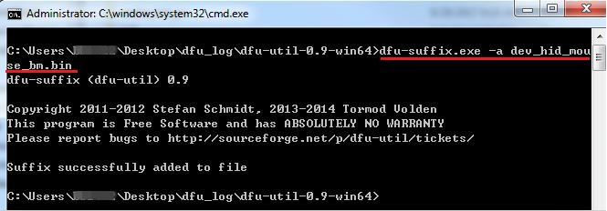
8.  Open cmd of windows. use the tool unzip from dfu-util-0.9-win64.zip.
<br> run the command: dfu-util.exe -d your_vid:pid -D your firmware.
<br>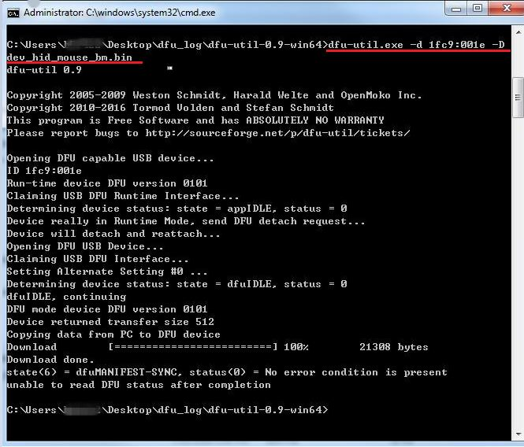
9.the com port will output "crc check ok", then confirm right port is connect to pc according to Getting Started , and one hid mouse will be enumerated by PC, The mouse arrow will 
be moving on PC screen in the rectangular rotation after download.
<br>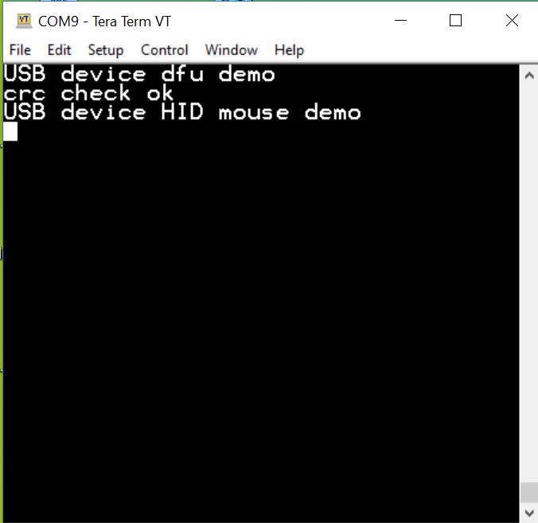
note<br>
- The test steps are done on windows 7 64bit PC. 
- the example supports automated driver installation on winows8 later.
- User need install driver for dfu example the first time conneted to one PC port for some vista and windows 7 that don't support WinUSB WCID .
- On specific Windows PC, the dfu-util may show "Cannot open DFU device your_PID:VID". user can try re-build the dfu-util on your PC.
 see the following how to install driver.
## Installing the dfu driver for dfu example
Below are the steps to install the dfu driver on Windows 7 OS. Similar process applies to Windows XP OS.<br>
Step 1. Click "Update Driver Software..."

<br>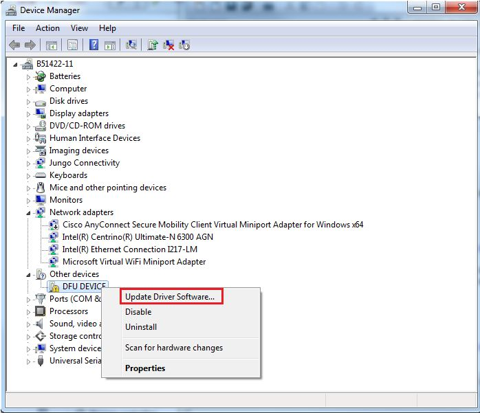

Step 2. Choose "Browse..."

<br>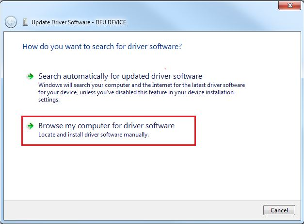

Step 3. Select "Let me pick..."

<br>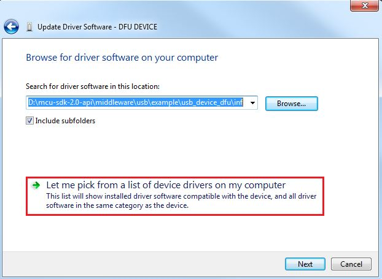

Step 4. Select "Next"

<br>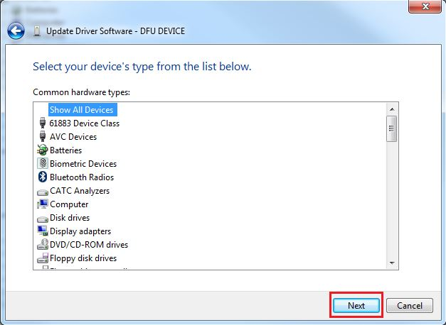

Step 4.Select "Have Disk" and then "Browse" 
Navigate to your DFU driver location.

<install_dir>\\boards\\<board>\\usb_examples\\usb_device_dfu\\inf

or

<install_dir>\\boards\\<board>\\usb_examples\\usb_device_dfu_lite\\inf


<br>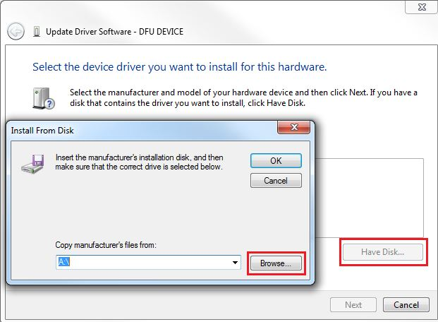

Step 5. Press "Next".

<br>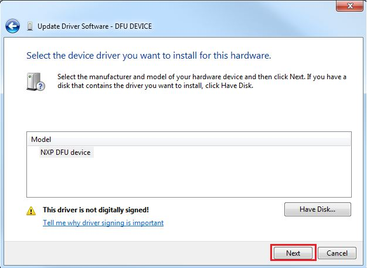

Step 6. Ignore the warning and press "Yes".

<br>

Step 7. Now the dfu driver should be installed successfully.

<br>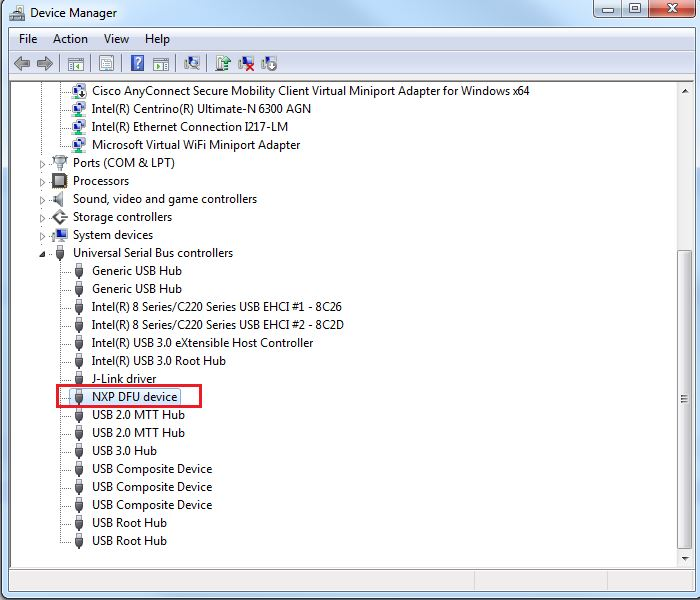

- If a driver signature issue occurs on Windows 8 OS,  see the link,\n
[Disabling Driver Signature on Windows 8](https://learn.sparkfun.com/tutorials/disabling-driver-signature-on-windows-8/disabling-signed-driver-enforcement-on-windows-8)
- To enable driver signing on Windows OS, see the link,
  + <a href="msdn.microsoft.com/en-us/library/windows/hardware/ff544865(v=vs.85.aspx)">Driver Signing</a>
  + [Practical Windows Code and Driver Signing](http://www.davidegrayson.com/signing/#howto)
  
## Adding CRC32 to your own binary
- The dfu-util software could download firmware to dfu device, but the tool could not add CRC32 to the firmware. 
however,the dfu example will check the CRC32 to confirm that the fireware written into the flash has no bit error. so we 
need modify the dfu-util source code to add CRC32 to the firmware, and then build the source code, after build, 
use the newly-build tool to add CRC32 to the firmware.
- To support the feature that add CRC32 to the file for download , please download the dfu-util source code 
and make these updates.
1. Function `dfu_store_file`in dfu-util\src\dfu_file.c \n
This function is updated as follows :\n
```
    /* write suffix, if any */
    if (write_suffix) {
        uint8_t dfusuffix[DFU_SUFFIX_LENGTH];

        dfusuffix[0] = file->bcdDevice & 0xff;
        dfusuffix[1] = file->bcdDevice >> 8;
        dfusuffix[2] = file->idProduct & 0xff;
        dfusuffix[3] = file->idProduct >> 8;
        dfusuffix[4] = file->idVendor & 0xff;
        dfusuffix[5] = file->idVendor >> 8;
        dfusuffix[6] = file->bcdDFU & 0xff;
        dfusuffix[7] = file->bcdDFU >> 8;
        dfusuffix[8] = 'U';
        dfusuffix[9] = 'F';
        dfusuffix[10] = 'D';
        dfusuffix[11] = DFU_SUFFIX_LENGTH;

        /*crc = dfu_file_write_crc(f, crc, dfusuffix,
            DFU_SUFFIX_LENGTH - 4);*/

        dfusuffix[12] = crc;
        dfusuffix[13] = crc >> 8;
        dfusuffix[14] = crc >> 16;
        dfusuffix[15] = crc >> 24;

        crc = dfu_file_write_crc(f, crc, dfusuffix + 12, 4);
    }
```
2. after update the soure code, build the source to get the tool.\n
3. if you build the sourcec code on windows 64bit PC, you will get new tool in the following path:
install_path:\\msys64\\home\\~your user name\\build\\bin
<br>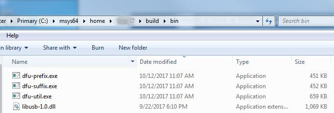
<br> use the newly-build tool dfu-suffix.exe to add CRC32 to your firmware. 
> in order to distinguish this dfu-suffix.exe with the dfu-suffix.exe in dfu-util-0.9-win64.zip. we called this as newly-build tool dfu-suffix.exe. 
<br>  Open cmd of windows. run the following command with newly-build tool dfu-suffix.exe, then CRC32 will be added to your firmware.
<br>    dfu-suffix.exe -a your_firmware.
<br>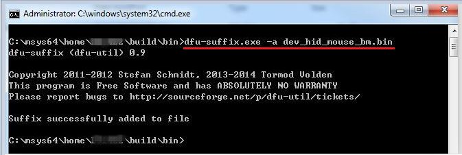
*/


## Supported Boards
- MIMXRT1170-EVKB
- EVK-MIMXRT1064
- MIMXRT685-AUD-EVK
- FRDM-MCXA276
- MIMXRT1060-EVKB
- MIMXRT1040-EVK
- FRDM-MCXN947
- MIMXRT1024-EVK
- [MCX-N5XX-EVK](../../_boards/mcxn5xxevk/usb_examples/usb_device_dfu/example_board_readme.md)
- MIMXRT1060-EVKC
- MIMXRT1160-EVK
- MIMXRT1180-EVK
- EVK-MIMXRT1020
- MIMXRT700-EVK
- [FRDM-MCXA156](../../_boards/frdmmcxa156/usb_examples/usb_device_dfu/example_board_readme.md)
- EVK-MIMXRT685
- [MCX-N9XX-EVK](../../_boards/mcxn9xxevk/usb_examples/usb_device_dfu/example_board_readme.md)
- EVKB-IMXRT1050
- RD-RW612-BGA
- FRDM-MCXN236
- FRDM-RW612
