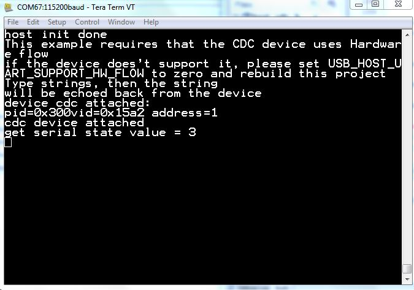

# host_cdc

## Overview

The host CDC project is a simple demonstration program based on the MCUXpresso SDK. 
It enumerates a COM port and echoes back the data from the UART as follows: 
1.  The host CDC receives data from the UART, which is plugged in the PC. Type characters in the terminal tool, such as Tera Term,
    and the characters are sent to the host example.
2.  After the host example receives data from the UART, it sends the data to the device virtual COM. 
3.  After the data has been sent to the device virtual COM successfully, it receives the same data from the device virtual COM.
4.  If the host has received the data, it sends data to the UART using the UART driver API. The UART echoes back data to the PC.

## System Requirement

### Hardware requirements

- Mini/micro USB cable
- USB A to micro AB cable
- Hardware (Tower module/base board, and so on) for a specific device
- Personal Computer(PC)

### Software requirements

- The project path is: 
  <MCUXpresso_SDK_Install>/boards/<board>/usb_examples/usb_host_cdc/<rtos>/<toolchain>.
> The <rtos> is Bare Metal or FreeRTOS OS.

## Getting Started

### Hardware Settings

> Set the hardware jumpers (Tower system/base module) to default settings.

### Prepare the example

1.  Download the program to the target board.
2.  Power off the target board and power on again.
3.  Connect devices to the board.

> For detailed instructions, see the appropriate board User's Guide.

## Run the example

1.  Run the host_cdc_serial example. The printed guide is displayed. Follow the guide to modify the demo.
2.  Make sure to use a USB HUB or an adapter with OTG functionality firstly. Plug in the CDC device. The attached information is printed out.
3.  Type a string and the string is sent to the CDC device if the string length is greater than
  USB_HOST_SEND_RECV_PER_TIME. If the length is shorter than the
    USB_HOST_SEND_RECV_PER_TIME, the string is echoed back later.
 After that, the CDC host reads back the string and puts it to stdout.

 

*/

## Supported Boards
- MIMXRT1170-EVKB
- [FRDM-K22F](../../_boards/frdmk22f/usb_examples/usb_host_cdc/example_board_readme.md)
- [LPCXpresso55S69](../../_boards/lpcxpresso55s69/usb_examples/usb_host_cdc/example_board_readme.md)
- EVK-MIMXRT1064
- MIMXRT685-AUD-EVK
- [LPCXpresso54S018](../../_boards/lpcxpresso54s018/usb_examples/usb_host_cdc/example_board_readme.md)
- [LPCXpresso55S16](../../_boards/lpcxpresso55s16/usb_examples/usb_host_cdc/example_board_readme.md)
- [LPCXpresso54S018M](../../_boards/lpcxpresso54s018m/usb_examples/usb_host_cdc/example_board_readme.md)
- MIMXRT1060-EVKB
- EVK-MIMXRT1010
- MIMXRT1040-EVK
- FRDM-MCXN947
- MIMXRT1024-EVK
- [LPCXpresso55S28](../../_boards/lpcxpresso55s28/usb_examples/usb_host_cdc/example_board_readme.md)
- [LPCXpresso54628](../../_boards/lpcxpresso54628/usb_examples/usb_host_cdc/example_board_readme.md)
- LPCXpresso55S36
- [MCX-N5XX-EVK](../../_boards/mcxn5xxevk/usb_examples/usb_host_cdc/example_board_readme.md)
- MIMXRT1060-EVKC
- MIMXRT1160-EVK
- MIMXRT1180-EVK
- [FRDM-K32L2A4S](../../_boards/frdmk32l2a4s/usb_examples/usb_host_cdc/example_board_readme.md)
- EVK-MIMXRT1020
- MIMXRT700-EVK
- EVK-MIMXRT595
- EVK-MIMXRT685
- [MCX-N9XX-EVK](../../_boards/mcxn9xxevk/usb_examples/usb_host_cdc/example_board_readme.md)
- EVKB-IMXRT1050
- RD-RW612-BGA
- EVK-MIMXRT1015
- FRDM-MCXN236
- FRDM-RW612
