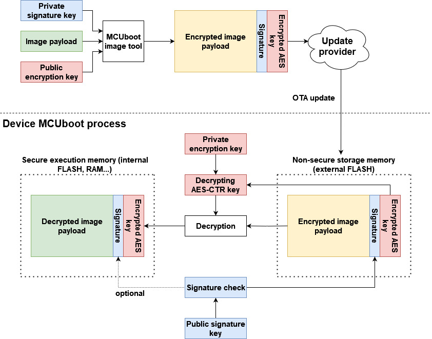
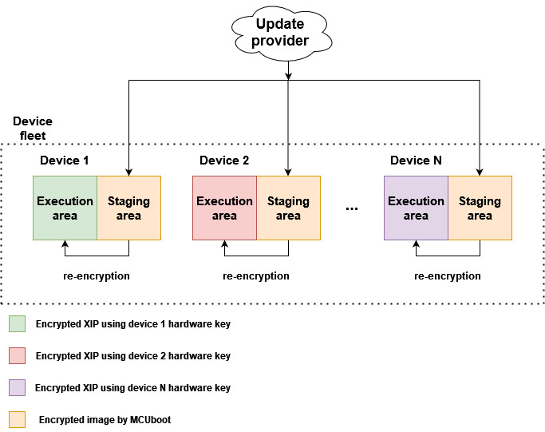
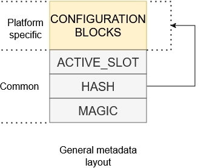
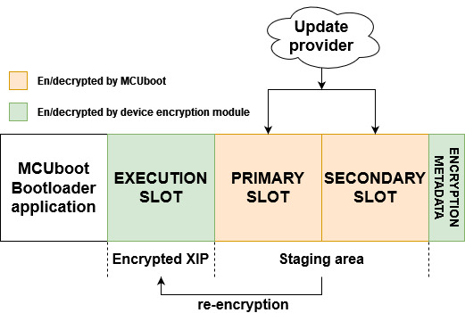
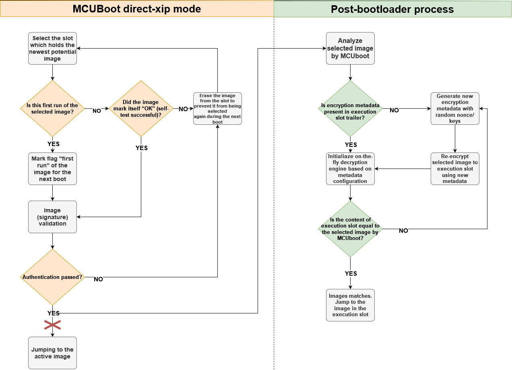
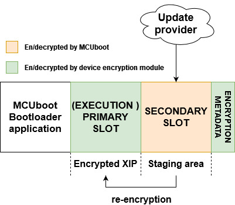
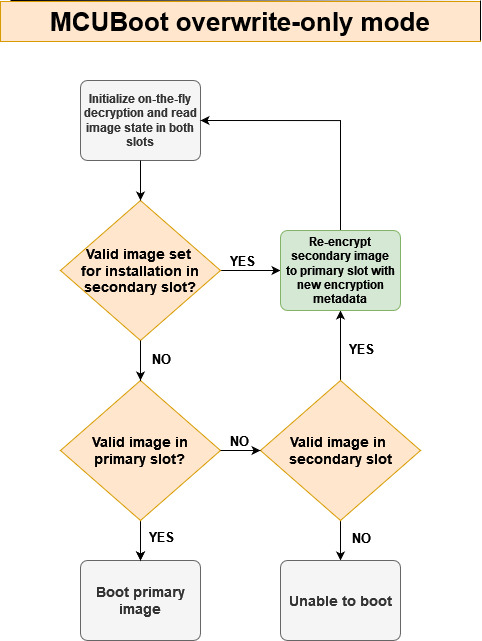
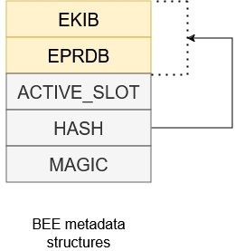
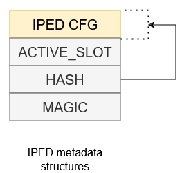

# MCUBoot and NXP encrypted XIP extension

- [MCUBoot and NXP encrypted XIP extension](#mcuboot-and-nxp-encrypted-xip-extension)
   * [1. Introduction](#1-introduction)
   * [2. MCUBoot encrypted image](#2-mcuboot-encrypted-image)
   * [3. Encrypted XIP extension for MCUboot](#3-encrypted-xip-extension-for-mcuboot)
      + [3.1 Configuration structures](#31-configuration-structures)
      + [3.2 Modes of extension](#32-modes-of-extension)
         - [3.2.1 Three slot configuration](#321-three-slot-configuration)
         - [3.2.2 Overwrite-only mode](#322-overwrite-only-mode)
   * [4. NXP encryption engines](#4-nxp-encryption-engines)
      + [4.1 BEE (Bus Encryption Engine)](#41-bee-bus-encryption-engine)
      + [4.2 OTFAD (On-the-Fly AES Decryption Module)](#42-otfad-on-the-fly-aes-decryption-module)
      + [4.3 IPED (Inline Prince Encryption/Decryption for off-chip flash)](#43-iped-inline-prince-encryptiondecryption-for-off-chip-flash)
      + [4.4 NPX (PRINCE encryption/decryption for on-chip flash)](#44-npx-prince-encryptiondecryption-for-on-chip-flash)
   * [5. OTA examples instructions](#5-ota-examples-instructions)
      + [5.1 Enable encrypted XIP support and build projects](#51-enable-encrypted-xip-support-and-build-projects)
      + [5.2 Generate RSA key pairs for encrypted image containers](#52-generate-rsa-key-pairs-for-encrypted-image-containers)
      + [5.3 Sign and encrypt image](#53-sign-and-encrypt-image)
      + [5.4 Evaluate encrypted XIP example](#54-evaluate-encrypted-xip-example)
         - [5.4.1 Load encrypted image container to flash memory](#541-load-encrypted-image-container-to-flash-memory)
         - [5.4.2 Run unsigned unencrypted OTA application (debug session)](#542-run-unsigned-unencrypted-ota-application-debug-session)
      + [5.5 Running encrypted image](#55-running-encrypted-image)

## 1. Introduction

To provide confidentiality of image data while in transport to the device or while residing on an non-secure storage such as external flash memory, MCUboot has support for encrypting/decrypting images on-the-fly while upgrading. The design expects that XIP is done from an secure memory so authenticated encrypted image is decrypted to a secure location such as internal Flash or RAM. 

Some NXP devices support encrypted XIP on an internal or external Flash device utilizing on-the-fly decryption modules (BEE, OTFAD, IPED, NPX...). Is possible use these dencryption engines with a second stage bootloader as the MCUBoot.

This document describes an extension of MCUBoot functionality to support encrypted XIP on NXP devices and its enablement in OTA examples in MCUXpresso SDK.

## 2. MCUBoot encrypted image

In the extension the encrypted image by MCUBoot is used as secure capsule for transport and staging in non-xip area of device.

In summary, an image payload is encrypted using AES-CTR cipher by image tool (see [imgtool](https://docs.mcuboot.com/imgtool.html)). The AES key is randomized per OTA image and padded to image as an encrypted TLV section. The encrypted AES key can be decrypted using private key in selected key encryption scheme (RSA-OAEP, AES-KW, ECIES-P256 or ECIES-X25519).

Following image shows keys management of MCUboot encrypted image.

Note: Current version of MCUboot (2.0.0) doesn't support hardware format of private key using trusted sources (OTP, TPM...) and currently supports only private key embed as an array in MCUboot code (see `middleware\mcuboot_opensource\boot\nxp_mcux_sdk\keys.c`). User is advised to implement secure provisioning and loading of the private key in device, for example by encrypting the MCUboot or staging private key in encrypted secure area. Support of hardware keys for encrypted images is targeted for next release of MCUboot. For simplicity the ota examples in SDK uses unencrypted MCUBoot application so there is no need for provisioning of device.

For more information please see [MCUBoot Encrypted images documentation](https://docs.mcuboot.com/encrypted_images.html). 

## 3. Encrypted XIP extension for MCUboot

The extension combines usage of platform specific encryption module and funcionality of MCUBoot encrypted images created by imgtool. 

Following image shows simplified OTA update flow of device fleet using encrypted XIP extension.

Device fleet shares MCUBoot private key used for decryption of encrypted OTA images residing on staging areas. The MCUBoot AES key and hardware encryption module are then used for image re-encryption to the execution area. Hardware key is provisioned by NXP or user and is typically unique per device instance to prevent image cloning.

### 3.1 Configuration structures

In summary, every NXP encryption unit utilizing encrypted XIP uses a scheme where on-the-fly decryption is configured by ROM. After device reset, the ROM investigates specific configuration structures expected typically at particular flash offset of header of bootable image. If configuration structures consisting encrypted keys and IVs are valid then the ROM configures the encryption unit. 

In case of OTA update it is expected that for security reasons we have to update key and/or IV of encrypted execution region so also these configuration blocks have to be re-generated. Unfornately this creates a risk during updating these configuration blocks as there is a period in time where a power-loss could corrupt the update and result in bricked device.

Note: The issue is related to only second stage bootloader usage. OTA ROM only based solution typically utilize dual image feature which safely handles this issue.

The risk is resolved by moving configuration blocks of execution regions at particular flash area and let SBL configure encryption module manually.

MCUBoot determines the boot state by inspecting the image trailers (mcuboot metadata) which have reserved area at the end of each slot. The ecrypted XIP extension uses reserved area called **encryption metadata** what is platform specific and used for particular target encryption handling. Following image shows general structure of encryption metadata.

The metadata sector consists platform specific configuration blocks and common confirmation block.
The slot number is pointer to slot containing selected image extracted from MCUBoot response object. Hash acts as confirmation of integrity of configuration blocks and content in execution slot.

During update the extension generate new configuration block with IV, write it at particular flash offset and reconfigure encryption unit for execution area. If the update and verification of the execution area are successful the configuration block is then hashed and confirmed by writing confirmation block. 

### 3.2 Modes of extension

The extension utilize layout with one execution slot for encrypted XIP and one or two slots for staging OTA image.
Partition layout can be configured in two configuration modes which are summarized in following table

| **Extension mode** | **required flash size**               | **rollback (self-test) support** | MCUBOOT update mode    |
|--------------------|---------------------------------------|----------------------------------|------------------------|
| **Three slot**     | SBL + 3 x slot size + metadata sector | yes                              | DIRECT-XIP             |
| **Overwrite-only** | SBL + 2 x slot size + metadata sector | no                               | MCUBOOT_OVERWRITE_ONLY |

#### 3.2.1 Three slot configuration

Following image shows flash memory layout using MCUboot bootloader in [DIRECT-XIP](https://docs.mcuboot.com/design.html#direct-xip) mode and encrypted XIP extension using three slot configuration.

Primary and secondary slot act as a staging area for encrypted OTA images and the execution slot is used as an execution area of encrypted image using platform on-the-fly decryption. The encrypted XIP is emulated by execution of working copy of authentized image by MCUboot.

Initial process of authentication and selection (active flag) of an image by MCUBoot is then extended by re-encryption of the selected image to the execution slot. This operation is handled by a post-bootloader process what is out of context of MCUboot and it is basically plugged just before jumping the selected image by MCUboot. The re-encryption is only done for new image selection, otherwise the content of execution slot is just validated for integrity against selected image in staging area. The process is demonstrated in module `encrypted_xip_mcuboot_support.c`.

Following image shows direct-xip flow of MCUBoot extended with encrypted XIP support.

Note: the placement of metadata in this mode is up to user. The metadata block can be stored at the end of the execution slot as the original mcuboot trailer is not used there anyway.

#### 3.2.2 Overwrite-only mode

This mode is much simpler but lacks revert functionality as there is only one staging slot.

Following image shows simplified flow of MCUBoot overwrite-only mode extended with encrypted XIP extension.

Before jumping to booting process the on-the-fly decryption is initialiazed so MCUboot is able to read and validate content in primary slot. Re-encryption process is implemented in customized MCUboot code and in MCUBoot hooks (see `flash_api.c` and `bootutil_hooks.c`).

## 4. NXP encryption engines

### 4.1 BEE (Bus Encryption Engine)

This peripheral is specific for RT10xx (except RT1010) and supports up two separate regions using two separate AES keys. In this solution, BEE region 1 is used for encrypting execution slot and BEE region 0 is reserved for a bootloader.

The BEE controller is automatically configured by ROM when specific encryption configuration blocks are found at the start of flash memory. The encryption configuration blocks are organized as __EPRDB__ (Encrypted Protection Region Descriptor BLock), the __EPRDB__ is encrypted using AES-CBC mode with AES key and IV in __KIB__ (Key Info Block). The __KIB__ is encrypted as __EKIB__ (Encrypted KIB) using key provisioned by user. Each BEE region has its __PRDB/KIB pair__. 

The EKIB is decrypted by a key based on selection in `BEE_KEYn_SEL` fuse:

* __Software key__
	* default value in `BEE_KEYn_SEL`
	* evaluating BEE without fusing the device
* __SW-GP2__
	* fused by user and typically used for offline encryption
	* limited funcionality due hardware bugs, see errata
	* not supported in this solution
* __OTPMK__
	* provisioned by NXP in factory
	* unique per device instance - prevents image cloning
	* __recommended__

Following image shows complete metadata structure used for devices with BEE.

Firmware in execution slot is de/encrypted using AES-CTR combining nonce extracted from PRDB and this device key. The extension automatically detects device key by evaluating `BEE_KEYn_SEL` fuse.

The whole BEE initialization and encryption metadata handling is resolved in module `encrypted_xip_platform_bee.c`.

Additional information can be found in Security Reference Manual of target device and in AN12800, AN12852 and AN12901.

### 4.2 OTFAD (On-the-Fly AES Decryption Module)

To be implemented...

### 4.3 IPED (Inline Prince Encryption/Decryption for off-chip flash)

IPED is encryption unit for external flash specific for NXP RW61x, RT700 and MCXN MCUs. 

Note:__The extension currently support only IPED module in RW61x based on GCM algorithm.__

Following image shows configuration of metadata structure used for devices with IPED.

There are several points when using IPED especially in GCM mode

* Consumption of physical memory when GCM algorithm is used
	* range of IPED region is defined in terms of logical address but the physical memory consumption is 1.25 times the logical memory consumption
	* OTA process must ensure that installed OTA image doesn't overlap size of IPED region, for example by adjusting the text size in linker file or doing checks of re-encrypted image size
* Flash operations have to	satisfy boundaries of the flash page/sector size and encryption unit size
	* see "Constraints on IPED regions" chapter in reference manual

The whole IPED initialization and encryption metadata handling is resolved in module `encrypted_xip_platform_iped.c`.

Additional information for IPED in RW61x can be found in Reference Manual.

### 4.4 NPX (PRINCE encryption/decryption for on-chip flash)

To be implemented...

## 5. OTA examples instructions

Start preferentially with an empty board, erasing original content if needed.
For demonstration we assume the 

### 5.1 Enable encrypted XIP support and build projects

Encrypted XIP can be evaluated by enabling define `CONFIG_ENCRYPT_XIP_EXT_ENABLE` in `sblconfig.h`.

Optional overwrite-only mode is enabled by `CONFIG_ENCRYPT_XIP_EXT_OVERWRITE_ONLY`.

Note: make sure that define `CONFIG_MCUBOOT_FLASH_REMAP_ENABLE` is disabled otherwise builds fails.

Build mcuboot_opensource and OTA application.

Load mcuboot_opensource.

### 5.2 Generate RSA key pairs for encrypted image containers

This part can be skipped as OTA examples in SDK uses pre-generated key pairs.

Generate private key
~~~
imgtool keygen -k enc-rsa2048-priv.pem -t rsa-2048
~~~
Adjust the content of the `middleware\mcuboot_opensource\boot\nxp_mcux_sdk\keys\enc-rsa2048-priv.pem` accordingly.

Extract private key to C-array
~~~
imgtool getpriv --minimal -k enc-rsa2048-priv.pem
~~~
Adjust the content of the `middleware\mcuboot_opensource\boot\nxp_mcux_sdk\keys\enc-rsa2048-priv-minimal.c` accordingly.

Derive public key key
~~~
imgtool getpub -k enc-rsa2048-pub.pem -e pem
~~~
Adjust the content of the `middleware\mcuboot_opensource\boot\nxp_mcux_sdk\keys\enc-rsa2048-pub.pem` accordingly.

### 5.3 Sign and encrypt image

To sign and encrypt an application binary, imgtool must be provided with respective key pairs and a set of parameters as in the following example:

For an OTA image use following set of commands:
~~~
 imgtool sign --key sign-rsa2048-priv.pem
	      --align 4
	      --header-size 0x400
	      --pad-header
	      --slot-size 0x200000
	      --max-sectors 800
	      --version "1.0"
	      -E enc-rsa2048-pub.pem
	      app_binary.bin
	      app_binary_SIGNED_ENCRYPTED.bin
~~~

For an image to be loaded using ISP the parameters `--pad --confirm` needs to be added. This applies only for three slot mode (direct-xip).

### 5.4 Evaluate encrypted XIP example

There are two methods how to run device for first time when application uses encrypted XIP.

#### 5.4.1 Load encrypted image container to flash memory

Look into `flash_partitioning.h` for your target.

For three slot configuration you will find:

~~~
/* Encrypted XIP extension: Three slot mode */

#define BOOT_FLASH_EXEC_APP             0x60040000  -- execution slot address
#define BOOT_FLASH_ACT_APP              0x60240000  -- primary staging slot address
#define BOOT_FLASH_CAND_APP             0x60440000  -- secondary staging slot address
#define BOOT_FLASH_ENC_META             0x60640000  -- encryption metadata address
~~~

Image generated with additional `--pad --confirm` can be loaded to primary or secondary slot.

For overwrite-only configuration you will find:

~~~
/* Encrypted XIP extension: modified overwrite-only mode */

#define BOOT_FLASH_ACT_APP              0x60040000  -- active slot address
#define BOOT_FLASH_CAND_APP             0x60240000  -- candidate slot address
#define BOOT_FLASH_ENC_META             0x60440000  -- encryption metada address
#define BOOT_FLASH_EXEC_APP             BOOT_FLASH_ACT_APP
~~~

Image has to be loaded always to candidate slot address. Additional `--pad --confirm` parameters are not needed here.

To load image the pyocd, blhost or MCUXpresso Secure Provisioning Tool can be used.

#### 5.4.2 Run unsigned unencrypted OTA application (debug session)

An unsigned unencrypted application can be loaded and run using a debug session. When performing an OTA update the application responses with warning:
~~~
WARNING: invalid metadata of execution slot - debug session?
WARNING: OTA image will be downloaded to secondary slot
~~~
This is expected as there is no encryption metadata due debug purpose so application has no reference to linkage to referenced image in staging area.

Note: Is possible to attach to running encrypted application for debug purpose.

### 5.5 Running encrypted image

These are expected outputs when an OTA image is detected and then re-encrypted

Three slot configuration:
~~~
hello sbl.
Bootloader Version 2.0.0
Primary   slot: version=1.0.0+0
Image 0 Secondary slot: Image not found
writing copy_done; fa_id=0 off=0x1fffe0 (0x43ffe0)
Image 0 loaded from the primary slot

Starting post-bootloader process of encrypted image...
Referenced image is located in the primary slot
Decrypting and loading MCUBOOT AES-CTR key for staged image...
AES-CTR key loaded
Checking execution slot...
No valid image found in staging area...
Preparing execution slot for new image
Installing new image into execution slot from staged area
On-the-fly initialization completed
Re-encrypting staged image in execution slot...
........................................................................
Loading image successful
Image verification successful
Post-bootloader process of encrypted image successful

Bootloader chainload address offset: 0x40000
Reset_Handler address offset: 0x40400
Jumping to the image

OTA HTTPS client demo (Ethernet)

Initializing PHY...
Obtaining IP address from DHCP...
~~~

Overwrite-only mode:
~~~
hello sbl.
Bootloader Version 2.0.0
On-the-fly decryption initialization completed
Image index: 0, Swap type: test
Image 0 upgrade secondary slot -> primary slot
Erasing the primary slot
On-the-fly decryption initialization completed
Image 0 copying the secondary slot to the primary slot: 0x9734 bytes
writing magic; fa_id=0 off=0x1ffff0 (0x23fff0)
erasing secondary header
erasing secondary trailer
Bootloader chainload address offset: 0x40000
Reset_Handler address offset: 0x40400
Jumping to the image

*************************************
* Basic MCUBoot application example *
*************************************

Built Nov 30 2024 21:01:35

$
~~~