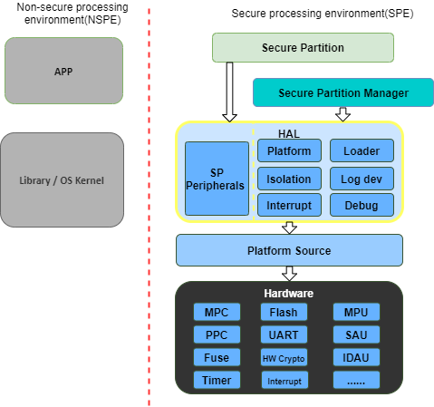

##########################
Hardware Abstraction Layer
##########################

:Organization: Arm Limited
:Contact: tf-m@lists.trustedfirmware.org

:API Version: 0.9

************
Introduction
************
:term:`TF-M` :term:`HAL` abstracts the hardware-oriented and platform specific
operations on the :term:`SPE` side and provides a set of APIs to the upper
layers such as :term:`SPM`, :term:`RoT Service`.
The :term:`HAL` aims to cover the platform different aspects whereas common
architecturally defined aspects are done generically within the common
:term:`SPE`.
In some cases, although the operations are defined architecturally,
it may not be possible to generalize implementations because lots of information
is only known to platforms.
It is more efficient to define a :term:`HAL` API for those architectural
operations as well.

.. note::
  :term:`TBSA-M` provides the hardware requirements for security purposes.
  :term:`TF-M` :term:`HAL` tries to reference :term:`TBSA-M` recommendations in
  the interfaces from the software perspective only. Please reference
  :term:`TBSA-M` for your security hardware design.

Design Goals
============
:term:`TF-M` :term:`HAL` is designed to simplify the integration efforts on
different platforms.

:term:`TF-M` :term:`HAL` is designed to make it easy to use the hardware and
develop the :term:`SPM` and :term:`RoT Service` which need to access the
devices.

:term:`TF-M` :term:`HAL` is designed to make the structure clearer and let the
:term:`TF-M` mainly focus on :term:`PSA` implementation.

********
Overview
********
This section provides an overview of the abstraction layer structure.

Here lists a minimal set of necessary functionalities:

  - **Isolation API**: Provides the necessary isolation functionalities required
    by the :term:`PSA-FF-M` and :term:`TBSA-M`, and provides APIs to :term:`SPM`
    to check the permissions of memory access.
  - **Platform API**: Provides the platform initialization, platform-specific
    memory information, system reset, etc.
  - **Loader API**: Provides the functions to load partitions and services and
    provides the necessary data to :term:`SPM`.
  - **Log dev API**: Provides the log system functions.
  - **Interrupt API**: Provides the interrupt functions.

.. note::
  - There is a non-secure :term:`HAL` that focuses on the mailbox operation API
    for Dual-core topology. For more information about it, please refer to
    :doc:`Mailbox Design in TF-M on Dual-core System
    </docs/design_documents/dual-cpu/mailbox_design_on_dual_core_system>`.
  - The minimal set of :term:`TF-M` :term:`HAL` is sufficient for Secure
    Partitions by using customized peripheral interfaces. To provide easier
    portability for the Secure Partitions, a Secure Partition :term:`HAL` is
    provided in this design too.
  - The debug mechanisms give the external entity the corresponding right to
    access the system assets. :term:`TF-M` ensures that the external entity is
    permitted access to those assets. Currently, :term:`TF-M` only needs the
    debug authentication. The whole debug mechanism and related :term:`HAL` will
    be enhanced in the future. Please refer to the :doc:`Debug authentication
    settings section </platform/readme>` for more detail.

*****************
Design Principles
*****************
As :term:`TF-M` runs on resource-constrained devices, the :term:`HAL` tries to
avoid multiple level abstractions which cost more resources.

Part of the :term:`HAL` interfaces does not focus on exact hardware operations
such as power on/off or PIN manipulation.
Instead, the :term:`HAL` abstracts higher-level interfaces to reserve the
implementation flexibility for the platform vendors.

The :term:`TF-M` :term:`HAL` should be easy to deprecate APIs and provide
compatibilities.
Any API incompatibility should be detected during building.

:term:`TF-M` relies on the :term:`HAL` APIs to be implemented correctly and
trusts the :term:`HAL` APIs.
:term:`TFM` can provide assertions to detect common programming errors but
essentially no further extensive checks will be provided.

************
Source Files
************
This section describes the source file of the :term:`TF-M` :term:`HAL`,
including the header and c files.

tfm_hal_defs.h
==============
This header file contains the definitions of common macros and types used by all
:term:`HAL` APIs. Please refer to `Status Codes`_ for detailed definitions.

tfm_hal_[module].[h/c]
======================
All other headers and c files are classified by the modules, such as isolation,
platform, interrupt, devices, etc.

.. note::
  There are common files in the platform folder include the implemented
  :term:`HAL` APIs. The platform vendors can use them directly but need to
  implement all the sub APIs.

************
Status Codes
************
These are common status and error codes for all :term:`HAL` APIs.

Types
=====
tfm_hal_status_t
----------------
This is a status code to be used as the return type of :term:`HAL` APIs.

.. code-block:: c

  typedef int32_t tfm_hal_status_t

Error Codes
===========
Negative values indicate an error. Zero and positive values indicate success.

Here is the general list. The detailed usages for each error code are described
in the API introduction sections.

TFM_HAL_SUCCESS
---------------
Status code to indicate general success.

.. code-block:: c

  #define TFM_HAL_SUCCESS ((tfm_hal_status_t)0)

TFM_HAL_ERROR_GENERIC
---------------------
Status code to indicate an error that does not correspond to any defined failure
cause.

.. code-block:: c

  #define TFM_HAL_ERROR_GENERIC ((tfm_hal_status_t)-1)

TFM_HAL_ERROR_NOT_INIT
----------------------
Status code to indicate that the module is not initialed.

.. code-block:: c

  #define TFM_HAL_ERROR_NOT_INIT ((tfm_hal_status_t)-2)

TFM_HAL_ERROR_INVALID_INPUT
---------------------------
Status code to indicate that the input is invalid.

.. code-block:: c

  #define TFM_HAL_ERROR_INVALID_INPUT ((tfm_hal_status_t)-3)

TFM_HAL_ERROR_NOT_SUPPORTED
---------------------------
Status code to indicate that the requested operation or a parameter is not
supported.

.. code-block:: c

  #define TFM_HAL_ERROR_NOT_SUPPORTED ((tfm_hal_status_t)-4)

TFM_HAL_ERROR_BAD_STATE
-----------------------
Status code to indicate that the requested action cannot be performed in the
current state.

.. code-block:: c

  #define TFM_HAL_ERROR_BAD_STATE ((tfm_hal_status_t)-5)

TFM_HAL_ERROR_MAX_VALUE
-----------------------
Status code to indicate that the current number has got the max value.

.. code-block:: c

  #define TFM_HAL_ERROR_MAX_VALUE ((tfm_hal_status_t)-6)

TFM_HAL_ERROR_MEM_FAULT
-----------------------
Status code to indicate that the memory check failed.

.. code-block:: c

  #define TFM_HAL_ERROR_MEM_FAULT ((tfm_hal_status_t)-7)

--------------

*Copyright (c) 2020, Arm Limited. All rights reserved.*
