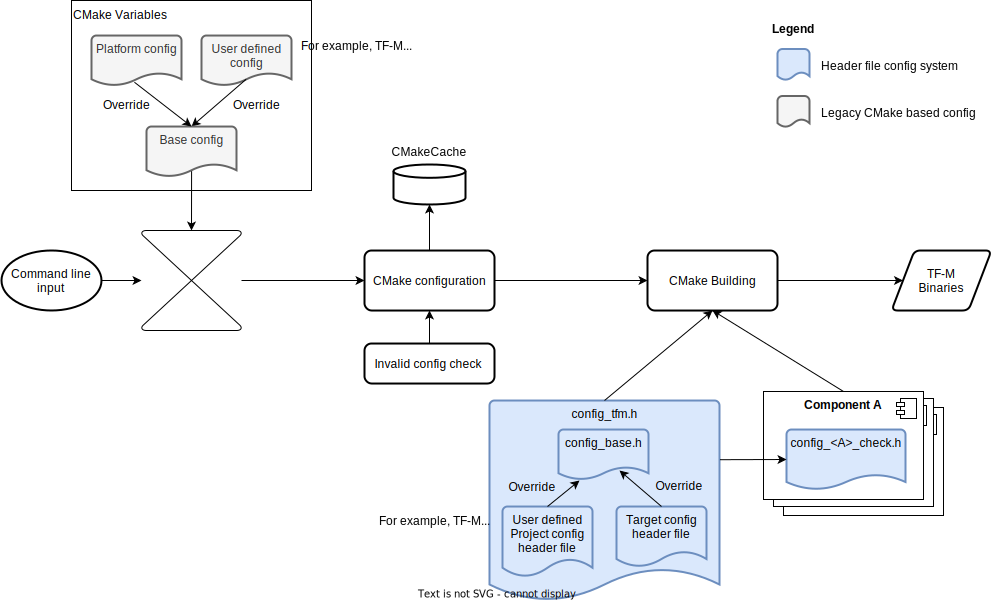

.. _Header_configuration:

#############################
The Header File Config System
#############################

The header file configurations system is used to fine-tune component options.

The following diagram shows how the system works.

Source files shall include ``config_tfm.h`` when necessary to fetch Component option settings.
It is expected that all Component options are included in ``config_tfm.h`` to explicitly set values
for each option.

The ``config_tfm.h`` includes base configuration ``config_base.h``. Refer to
:ref:`Base_configuration` for details of the base configurations.

The ``config_tfm.h`` includes a customized project config file provided via compile definition
``PROJECT_CONFIG_HEADER_FILE``. Customized Component options in the project config file overrides
those configured in ``config_base.h``.
The project config header file can be

- Generated by the TF-M Kconfig system <kconfig_system>
- One of the header files of Profiles <tf-m_profiles>, set via the ``TFM_PROFILE`` build option.
- Manually customized profile based on pre-set profiles.

Users set CMake variable ``PROJECT_CONFIG_HEADER_FILE`` with the full path of the configuration
header file.

A platform can adjust or place restriction on config options by providing a ``config_tfm_target.h``
under the root folder of their platforms.
If the build system finds the file, it sets the ``TARGET_CONFIG_HEADER_FILE`` compile definition.
Platform specific option settings in ``TARGET_CONFIG_HEADER_FILE`` overrides those configured in
``config_base.h``.

.. code-block:: c

    #ifdef TARGET_CONFIG_HEADER_FILE
    #include TARGET_CONFIG_HEADER_FILE
    #endif

    #ifdef PROJECT_CONFIG_HEADER_FILE
    #include PROJECT_CONFIG_HEADER_FILE
    #endif

    #include "config_base.h"

Each component can implement a ``config_<comp_name>_check.h`` to validate component specific config
dependencies. ``config_<comp_name>_check.h`` shall include ``config_tfm.h``

--------------

*Copyright (c) 2022, Arm Limited. All rights reserved.*
