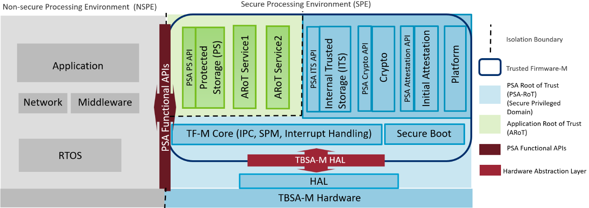

##################
Trusted Firmware M
##################

Trusted Firmware-M (TF-M) implements the Secure Processing Environment (SPE)
for Armv8-M, Armv8.1-M architectures (e.g. the `Cortex-M33`_, `Cortex-M23`_,
`Cortex-M55`_ processors) and dual-core platforms. It is the platform security
architecture reference implementation aligning with PSA Certified guidelines,
enabling chips, Real Time Operating Systems and devices to become PSA Certified.

TF-M relies on an isolation boundary between the Non-secure Processing
Environment (NSPE) and the Secure Processing Environment (SPE). It can but is
not limited to using the `Arm TrustZone technology`_ on Armv8-M and Armv8.1-M
architectures. In pre-Armv8-M architectures physical core isolation is required.

**Trusted Firmware-M consists of:**

- Secure Boot to authenticate integrity of NSPE and SPE images
- TF-M Core responsible for controlling the isolation, communication and
  execution within SPE and with NSPE
- Crypto, Internal Trusted Storage (ITS), Protected Storage (PS) and
  Attestation secure services

   FF-M compliant design with TF-M

Applications and Libraries in the Non-secure Processing Environment can
utilize these secure services with a standardized set of PSA Functional APIs.
Applications running on Cortex-M devices can leverage TF-M services to ensure
secure connection with edge gateways and IoT cloud services. It also protects
the critical security assets such as sensitive data, keys and certificates on
the platform. TF-M is supported on several Cortex-M based
:doc:`Microcontrollers </platform/ext/index>` and Real Time Operating
Systems (RTOS).

Terms ``TFM`` and ``TF-M`` are commonly used in documents and code and both
refer to ``Trusted Firmware M.`` :doc:`Glossary </docs/glossary>` has the list
of terms and abbreviations.

#######
License
#######
The software is provided under a BSD-3-Clause :doc:`License </docs/contributing/lic>`.
Contributions to this project are accepted under the same license with developer
sign-off as described in the :doc:`Contributing Guidelines </docs/contributing/contributing_process>`.

This project contains code from other projects as listed below. The code from
external projects is limited to ``app``, ``bl2``, ``lib`` and ``platform``
folders. The original license text is included in those source files.

- The ``app`` folder contains files imported from CMSIS_5 project and the files
  have Apache 2.0 license.
- The ``bl2`` folder contains files imported from MCUBoot project and the files
  have Apache 2.0 license.
- The ``lib`` folder may contain 3rd party files with diverse licenses.
- The ``platform`` folder currently contains platforms support imported from
  the external project and the files may have different licenses.

###############
Getting Started
###############

************
Prerequisite
************
Trusted Firmware M provides a reference implementation of platform security
architecture  reference implementation aligning with PSA Certified guidelines.
It is assumed that the reader is familiar with specifications can be found at
`Platform Security Architecture Resources <https://developer.arm.com/architectures/security-architectures/platform-security-architecture>`__.

The current TF-M implementation specifically targets TrustZone for ARMv8-M so a
good understanding of the v8-M architecture is also necessary. A good place to
get started with ARMv8-M is
`developer.arm.com <https://developer.arm.com/architectures/cpu-architecture/m-profile>`__.

**************************
Build and run instructions
**************************
Trusted Firmware M source code is available on
`git.trustedfirmware.org <https://git.trustedfirmware.org/TF-M/trusted-firmware-m.git/>`__.

To build & run TF-M:

    - Follow the :doc:`TF-M getting started </docs/getting_started/tfm_getting_started>`
      to set up your environment.
    - Follow the
      :doc:`Build instructions </docs/technical_references/instructions/tfm_build_instruction>`
      to compile and build the TF-M source.
    - Follow the :doc:`Run TF-M examples on Arm platforms </docs/technical_references/instructions/run_tfm_examples_on_arm_platforms>`
      for information on running the example.

To port TF-M to a another system or OS, follow the
:doc:`OS Integration Guide </docs/integration_guide/tfm_integration_guide>`

:doc:`Contributing Guidelines </docs/contributing/contributing_process>` contains guidance on how to
contribute to this project.

###################
Platforms supported
###################
The document :doc:`Supported Platforms </platform/ext/index>` lists the details.

#########################
Release Notes and Process
#########################
The :doc:`Release Cadence and Process </docs/releases/release_process>` provides
release cadence and process information.

The :doc:`Releases </docs/releases/index>` provides details of
major features of the release and platforms supported.

####################
Feedback and support
####################
For this release, feedback is requested via email to
`tf-m@lists.trustedfirmware.org <tf-m@lists.trustedfirmware.org>`__.

.. _Cortex-M33: https://developer.arm.com/ip-products/processors/cortex-m/cortex-m33
.. _Cortex-M23: https://developer.arm.com/ip-products/processors/cortex-m/cortex-m23
.. _Cortex-M55: https://developer.arm.com/ip-products/processors/cortex-m/cortex-m55
.. _PSA Certified: https://www.psacertified.org/about/developing-psa-certified/
.. _Arm TrustZone technology: https://developer.arm.com/ip-products/security-ip/trustzone/trustzone-for-cortex-m

--------------

*Copyright (c) 2017-2021, Arm Limited. All rights reserved.*
